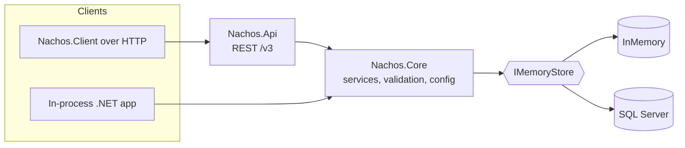

# Nachos

**Memory for stateful agents, built on .NET.**

[](LICENSE)
[](global.json)

Nachos is an independent, MIT-licensed .NET 10 implementation of the memory-server concepts and REST API shape of
[Honcho](https://honcho.dev) v3: workspaces, peers, sessions and messages, with the aim of an embeddable library plus a
service you can host yourself or on Azure. It is a clean-room project: it shares no source code or text with Honcho
(see [Licensing](#licensing-and-release-holds)).

> **Status: pre-release MVP (milestone M1).** Nothing is published: no NuGet packages, no container images, no
> documentation site, no tagged release. The repository builds from source, and this README describes only what is on
> this branch. Anything not yet available is marked as such and linked to its tracking issue. The project is developed
> with AI agents under manual review.

## What works today

- The Honcho-v3-shaped REST resources for **workspaces, peers, sessions and messages** (create/get-or-create, list,
  update, session membership, per-peer session config), served by `Nachos.Api` under `/v3`.
- Two storage providers behind one store interface: a non-durable **in-memory** provider and a **SQL Server** provider
  (schema owned by a database project and deployed from an embedded dacpac).
- An in-process library surface (`INachosClient`, `AddNachos`) and an HTTP implementation of the same interface
  (`Nachos.Client`, `AddNachosClient`).
- A bootstrap command line (`nachos`) for schema management, role grants and offline key minting.
- An [Aspire](https://aspire.dev) AppHost that starts SQL Server 2025 and the API for local development.
- Offline Bicep and `azd` definitions in [`infra/`](infra) and [`azure.yaml`](azure.yaml) (not verified against a live
  Azure subscription; see below).

**What does not work yet:** the HTTP API **rejects every `/v3` request with `401` unless authentication is explicitly
disabled for local development**, because authentication (and the idempotency adapter) is not yet part of this branch.
Memory reasoning (conclusions, dialectic chat, search, context, summaries, dreaming), webhooks, scopes and MCP are not
implemented. See [Compatibility and known limitations](#compatibility-and-known-limitations).

## Prerequisites

- **.NET SDK 10.0.100 or a later feature band**, per [`global.json`](global.json) (`rollForward: latestFeature`).
- **Docker** (Docker Desktop or any compatible engine) for the AppHost and for the SQL Server tests, which use
  Testcontainers. Not needed for the in-memory path.

## Quick start

### Build and test

```bash
dotnet build Nachos.slnx -c Release
dotnet test Nachos.slnx -c Release
```

The test suites that use SQL Server start containers, so Docker must be running. On this commit
`Nachos.Api.Tests.MessageEndpointsTests.TokenCount_UsesOrdinaryTextForSpecialSpellings` is a known failure
(the interim tokenizer, [#10](https://github.com/brendankowitz/nachos/issues/10)), and the infrastructure tests that
build the Bicep files need a recent Bicep CLI on your `PATH`.

### Run the API locally (in-memory store)

Authentication is on by default and, until it lands, rejects all `/v3` calls. For local experimentation it can be
switched off, **in the `Development` environment only** (the API refuses to start with authentication off in any other
environment). With no SQL connection string configured, the API uses the in-memory store, so everything is lost when it
stops.

PowerShell:

```powershell
$env:ASPNETCORE_ENVIRONMENT = "Development"
$env:Nachos__Auth__Enabled = "false"
dotnet run --project src/Nachos.Api --urls http://localhost:5080
```

bash / zsh:

```bash
ASPNETCORE_ENVIRONMENT=Development Nachos__Auth__Enabled=false \
  dotnet run --project src/Nachos.Api --urls http://localhost:5080
```

In another terminal (in PowerShell, call `curl.exe` rather than the `curl` alias):

```bash
# Get-or-create a workspace, then a peer, a session and a message
curl -s -X POST http://localhost:5080/v3/workspaces -H "Content-Type: application/json" -d '{"id":"demo"}'
curl -s -X POST http://localhost:5080/v3/workspaces/demo/peers -H "Content-Type: application/json" -d '{"id":"alice"}'
curl -s -X POST http://localhost:5080/v3/workspaces/demo/sessions -H "Content-Type: application/json" -d '{"id":"s1","peers":{"alice":{}}}'
curl -s -X POST http://localhost:5080/v3/workspaces/demo/sessions/s1/messages -H "Content-Type: application/json" \
  -d '{"messages":[{"peer_id":"alice","content":"hello"}]}'
curl -s -X POST http://localhost:5080/v3/workspaces/list -H "Content-Type: application/json" -d '{}'
```

Other endpoints available in `Development`: `/health`, `/health/live`, `/health/ready`, and the OpenAPI document at
`/openapi/v1.json`.

The API selects SQL Server instead of the in-memory store when `Nachos:SqlServer:ConnectionString` (or
`ConnectionStrings:nachos`, which the AppHost provides) is configured. A configured but blank or database-less value
fails startup rather than falling back to memory.

### Run with the Aspire AppHost (SQL Server)

```bash
dotnet run --project src/Nachos.AppHost --launch-profile http
```

This starts the Aspire dashboard (`http://localhost:15180`; the login URL is printed in the console), a SQL Server 2025
container with a persistent Docker data volume, and the API wired to it. In `Development` the AppHost enables automatic
schema deployment and sets a development signing key. The API listens on a port Aspire assigns; find it in the
dashboard, and `GET /health/ready` on it reports `Healthy` once the schema is deployed.

Be aware of the limit described above: **the AppHost does not turn authentication off**, so `/v3` calls against the
AppHost-started API currently return `401`. There is no supported way to disable authentication through the AppHost;
use the in-memory run above to try the API, and the AppHost to check the SQL Server wiring and health.
Authentication is described in the M1 plan (see Roadmap) and is not available yet.

## Library usage

Nachos is not published to NuGet. Until it is, reference the projects directly
([`Nachos.Hosting`](src/Nachos.Hosting), a provider such as
[`Nachos.DataLayer.InMemory`](src/DataLayer/Nachos.DataLayer.InMemory), and optionally
[`Nachos.Client`](src/Nachos.Client)).

### In process

```csharp
using Microsoft.Extensions.DependencyInjection;
using Nachos.Abstractions;
using Nachos.Abstractions.Contracts;

var services = new ServiceCollection();
services.AddNachos(nachos => nachos.UseInMemory());

await using var provider = services.BuildServiceProvider();
await using var scope = provider.CreateAsyncScope();
var nachos = scope.ServiceProvider.GetRequiredService<INachosClient>();

await nachos.GetOrCreateWorkspaceAsync("demo");
await nachos.GetOrCreatePeerAsync("demo", "alice");
await nachos.GetOrCreateSessionAsync("demo", "s1");
await nachos.AddSessionPeersAsync("demo", "s1", new Dictionary<string, SessionPeerConfig> { ["alice"] = new() });
await nachos.CreateMessagesAsync("demo", "s1", [new MessageCreate("hello", "alice")]);

var page = await nachos.ListMessagesAsync("demo", "s1", filters: null, new PageRequest());
foreach (var message in page.Items)
{
    Console.WriteLine($"{message.PeerId}: {message.Content}");
}
```

`INachosClient` is scoped. The in-memory provider is for tests and development only: it is not durable, and it logs a
warning at host start outside the `Development` environment. For durable storage reference
[`Nachos.DataLayer.SqlServer`](src/DataLayer/Nachos.DataLayer.SqlServer) and call
`UseSqlServer(options => options.ConnectionString = "...")` instead.

### Over HTTP

```csharp
services.AddNachosClient(options =>
{
    options.BaseAddress = new Uri("https://nachos.example.com"); // your server's root
    // options.ApiKey = "...";        // a NachosKey token, or
    // options.Credential = ...;      // an Entra TokenCredential (with options.Scopes)
});
```

This registers an HTTP-backed `INachosClient` with bounded retries for requests that are safe to repeat. The server side
of `ApiKey` and `Credential` is not accepted by this branch's API yet (see the status above).

## Command line

The `nachos` CLI is bootstrap tooling. It is run from source (it is not packaged as a .NET tool yet):

```bash
dotnet run --project src/Nachos.Cli -- --help
```

| Command | What it does |
|---|---|
| `schema status --connection <cs>` | Prints the database's schema position as JSON. |
| `schema report --connection <cs> [--out <file>]` | Shows what a deploy would change, without changing anything. |
| `schema upgrade --connection <cs> [--report-only] [--approve-reviewed] [--allow-data-loss] [--adopt-unstamped]` | Applies the schema. Exit `0`: applied or nothing to do; `2`: refused; `1`: error. |
| `keys create [--admin] [--workspace <id>] [--peer <id> \| --session <id>] [--expires <time>] --signing-secret-env <var>` | Mints a key offline and writes only the token to standard output. |
| `grants add --connection <cs> --object-id <id> --role <Nachos.Admin\|Nachos.Workspace> [--workspace <id>]` | Grants a role (idempotent). |
| `grants remove` (same options as `add`) | Removes a grant (idempotent). |
| `grants list --connection <cs> [--object-id <id>]` | Prints grants as JSON. |

Run `--help` on any command for the full options. Minted keys are not yet accepted by the API.

## Architecture



| Project | Role |
|---|---|
| [`Nachos.Abstractions`](src/Nachos.Abstractions) | Domain records, request/response contracts, `INachosClient`, store interfaces, filters. |
| [`Nachos.Core`](src/Nachos.Core) | The in-process `INachosClient` implementation, validation, configuration resolution, key issuing, token counting. |
| [`Nachos.Hosting`](src/Nachos.Hosting) | `AddNachos(...)` and the provider builder. |
| [`Nachos.DataLayer.InMemory`](src/DataLayer/Nachos.DataLayer.InMemory) | Non-durable provider for tests and development. |
| [`Nachos.DataLayer.SqlServer`](src/DataLayer/Nachos.DataLayer.SqlServer) | SQL Server provider and the `SchemaDeployer`. |
| [`Nachos.DataLayer.SqlServer.Database`](src/DataLayer/Nachos.DataLayer.SqlServer.Database) and [`.Sql2025`](src/DataLayer/Nachos.DataLayer.SqlServer.Database.Sql2025) | Database projects that own the DDL and produce the embedded dacpacs. |
| [`Nachos.Api`](src/Nachos.Api) | ASP.NET Core minimal API for `/v3`. |
| [`Nachos.Client`](src/Nachos.Client) | HTTP implementation of `INachosClient`. |
| [`Nachos.Cli`](src/Nachos.Cli) | The `nachos` bootstrap command line. |
| [`Nachos.AppHost`](src/Nachos.AppHost) | Aspire local-development host (SQL Server 2025 plus the API). |
| [`Nachos.ServiceDefaults`](src/Nachos.ServiceDefaults) | OpenTelemetry, health checks, shared service defaults. |
| [`infra/`](infra), [`azure.yaml`](azure.yaml) | Bicep and `azd` definitions for Azure Container Apps and Azure SQL. |

The full design is in [`docs/superpowers/specs/2026-10-07-nachos-design.md`](docs/superpowers/specs/2026-10-07-nachos-design.md)
and the milestone plans are in [`docs/superpowers/plans/`](docs/superpowers/plans). They describe the intended end state,
including parts (a background worker, agents, MCP) that are not on this branch.

## Compatibility and known limitations

### Implemented routes

`POST /v3/workspaces`, `POST /v3/workspaces/list`, `PUT /v3/workspaces/{id}`; peers (create, list, update,
`POST …/peers/{peer_id}/sessions`); sessions (create, list, update, add/set/remove/list peers, get/set per-peer config);
messages (create, list, get, update). Health endpoints are `/health`, `/health/live` and `/health/ready`.

### Staged routes that return `501 Not Implemented`

These routes exist so that clients get a stable, explicit answer rather than a 404:

- Keys and admin: `POST /v3/keys`, `POST /v3/admin/grants`.
- Workspaces: delete, chat, search, `queue/status`, `schedule_dream`, `jobs`.
- Conclusions: create, list, query, get, delete.
- Peers: `card` (get/put), `chat`, `context`, `representation`, `search`.
- Sessions: delete, `clone`, `context`, `messages/upload`, `search`, `summaries`.
- Scopes: create, list, get, `status`, and scope-session link/list/delete.
- Webhooks: list, create, test, delete.

### Other known limitations

- **Authentication and idempotency are pending.** `/v3` fails closed (see above). The planned idempotency adapter
  (M1 task 11) is not published on this branch, so do not rely on `Idempotency-Key` replay behaviour over HTTP.
- **Tokenizer.** Message `token_count` uses an interim `Microsoft.ML.Tokenizers` o200k counter. It has known
  residuals (work that grows quadratically per pre-token segment, ignored cancellation, supplementary-Unicode parity)
  that are a production-release gate: [#10](https://github.com/brendankowitz/nachos/issues/10).
- **SQL provider limits.** A metadata object key longer than 4000 UTF-16 code units cannot be stored by the SQL Server
  provider (the request is rejected with a `422`). A single filter may use at most 2000 SQL parameters (also a `422`). A pathological,
  unmergeable filter of roughly 10,000 conditions can reach the 30 s command timeout before SQL Server reports its
  complexity error, so the client sees a timeout rather than a `422`:
  [#18](https://github.com/brendankowitz/nachos/issues/18).
- **Pre-release database upgrade.** The schema version stays `1` until the first release, so a database created by an
  earlier M1 build reads as current. Any existing pre-release database must take the reviewed path once: run
  `schema report`, review it, then `schema upgrade --approve-reviewed` (no data is lost). New databases need nothing.
  See section 7.3 of the design spec.
- **Honcho SDK compatibility is only minimally verified.** A minimal smoke suite that drives the upstream Python
  (`honcho-ai` 2.5.1) and TypeScript (`@honcho-ai/sdk` 2.5.1) SDKs against Nachos lives in
  [`test/conformance`](test/conformance). Broader conformance is tracked in
  [#11](https://github.com/brendankowitz/nachos/issues/11); legacy `/v2` compatibility is tracked in
  [#4](https://github.com/brendankowitz/nachos/issues/4). Intentional deviations from Honcho's behavior are listed in
  section 9.4 of the design spec.
- **Known gap: the Python SDK's unfiltered list calls fail.** The Python SDK sends an empty `POST` body for a list
  call without filters, and Nachos currently answers it with `422 json_invalid`. The smoke suite records this as an
  expected failure (`xfail`); a fix is pending.

## Licensing and release holds

Nachos is released under the [MIT License](LICENSE). It is a clean-room implementation: Honcho's source, tests and prompt
text are not used, and the upstream SDKs are only ever intended as external test clients. Nachos is grateful to Honcho and
Plastic Labs for the concepts and public API design it is compatible with.

[`THIRD-PARTY-NOTICES.md`](THIRD-PARTY-NOTICES.md) records the scoped notices for `Microsoft.SqlServer.DacFx`,
the SqlClient SNI runtime and `Microsoft.SqlServer.Types`. It is not a complete dependency inventory.

**Release holds.** Because of those holds, **no binaries or container images are distributed yet**:

- The governing terms of `Microsoft.SqlServer.Types` 170.1000.7 are unresolved (its embedded licence is a pre-release
  evaluation document), which blocks distribution of artifacts that contain it:
  [#15](https://github.com/brendankowitz/nachos/issues/15).
- The tokenizer above is a production-release gate ([#10](https://github.com/brendankowitz/nachos/issues/10)).

**Azure.** [`infra/`](infra) and [`azure.yaml`](azure.yaml) define an `azd` deployment, but they have only been validated
offline. Deploying them creates cloud resources and requires the repository owner's explicit approval; do not treat the
deployment as supported or verified.

## Roadmap

Tracked as GitHub issues:

- Umbrella: [#2](https://github.com/brendankowitz/nachos/issues/2) (full Honcho v3 parity on .NET and Azure).
- Production gates: [#10](https://github.com/brendankowitz/nachos/issues/10) (exact managed tokenizer),
  [#15](https://github.com/brendankowitz/nachos/issues/15) (`Microsoft.SqlServer.Types` terms).
- Conformance and docs: [#11](https://github.com/brendankowitz/nachos/issues/11) (SDK conformance),
  [#16](https://github.com/brendankowitz/nachos/issues/16) (generated docs site and Pages),
  [#12](https://github.com/brendankowitz/nachos/issues/12) (docs tooling).
- Storage and deployment: [#18](https://github.com/brendankowitz/nachos/issues/18) (pathological SQL filters),
  [#7](https://github.com/brendankowitz/nachos/issues/7) (revision-based Container App deployment).
- Request handling: [#8](https://github.com/brendankowitz/nachos/issues/8) and
  [#9](https://github.com/brendankowitz/nachos/issues/9) (error-location and malformed-Unicode validation).
- Tooling and policy: [#13](https://github.com/brendankowitz/nachos/issues/13) (credential policy),
  [#14](https://github.com/brendankowitz/nachos/issues/14) (provenance tooling),
  [#17](https://github.com/brendankowitz/nachos/issues/17) (markdown execution handling).
- Later: [#3](https://github.com/brendankowitz/nachos/issues/3) (Honcho data import),
  [#4](https://github.com/brendankowitz/nachos/issues/4) (legacy `/v2`).

Authentication and the idempotency adapter are described in
the M1 plan ([`docs/superpowers/plans/2026-10-07-nachos-m1-foundation.md`](docs/superpowers/plans/2026-10-07-nachos-m1-foundation.md))
but are not available on this branch, and no date is promised.

## Contributing

Issues and pull requests are welcome. Please read the design spec first, and note the clean-room rule: do not read or
copy Honcho's source code when contributing.

## License

[MIT](LICENSE) © 2026 Brendan Kowitz. Third-party components keep their own licences; see
[`THIRD-PARTY-NOTICES.md`](THIRD-PARTY-NOTICES.md).
