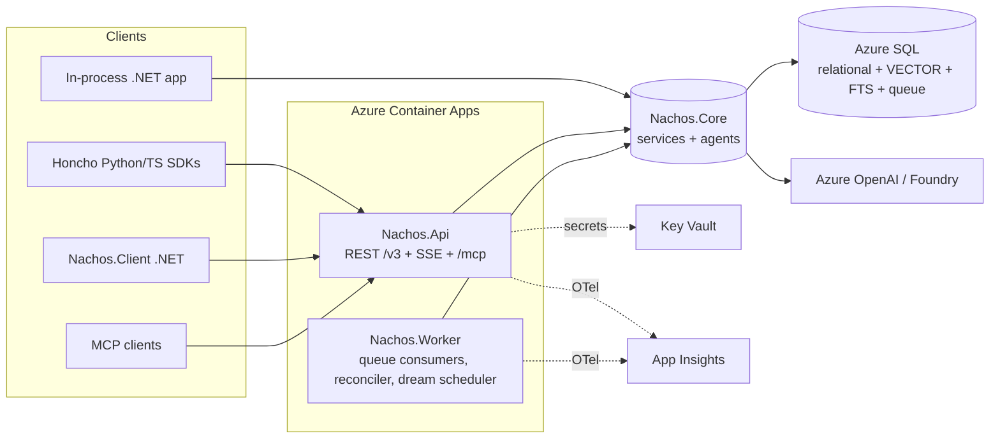

# Nachos — .NET / Azure Memory Server for Stateful Agents (Design Spec)

| | |
|---|---|
| **Status** | Proposed (draft for review) |
| **Date** | 2026-10-07 |
| **Reference system** | [plastic-labs/honcho](https://github.com/plastic-labs/honcho) v3 API. Research baseline: server `3.2.2`, `main` @ `e8d8b4a`. **Wire-conformance pin:** the public OpenAPI `3.3.0` (see R4). |
| **Cross-check** | [`research/2026-10-07-honcho-feature-map-astra.md`](research/2026-10-07-honcho-feature-map-astra.md), an independent mapping by a GPT-6 Astra research agent |
| **License** | MIT (clean-room; see §3) |

---

## 1. Intent

### 1.1 What was asked

- Build a .NET version of Honcho that is easy to deploy to Azure.
- Ship it **both** as a core library that runs in-process **and** as a hosted service that wraps the same core.
- Keep the REST API **mostly compatible** with Honcho `/v3`: same concepts and routes, with deviations allowed where .NET or Azure idioms are clearly better.
- Put storage behind a **pluggable abstraction backed by SQL Server / Azure SQL**. Manage the schema with an SDK-style **SQL Database Project and dacpac deployment, as in Ignixa**. For now the only other provider is in-memory, for tests.
- **Hosting:** Azure Container Apps through `azd` + Bicep, with API and worker as separate apps. Use .NET Aspire for local development.
- **Agent layer:** Microsoft Agent Framework, which succeeds Semantic Kernel and is built on `Microsoft.Extensions.AI`.
- **Auth:** Honcho-style scoped JWT keys **plus** Entra ID for admin and service callers.
- **Scope:** one spec covering **full Honcho v3 functional parity**: dreamer, scopes, webhooks, workspace chat, MCP.
- **Licensing:** clean-room reimplementation. Write our own prompts and keep MIT.
- **Docs (added by owner, 2026-10-07):** a **polished README in the style of `ignixa-fhir`**, and a **polished documentation site built with Astro**, deployable to **GitHub Pages** (§22).

### 1.2 Assumptions (correct these in review)

- Target **.NET 10 (LTS)** and C# 14, with central package management (`Directory.Packages.props`) and `global.json` pinned like Ignixa.
- The primary production database is **Azure SQL Database**. **SQL Server 2025** is supported for self-hosting in production (its own dacpac target; §7.3) and for local and dev containers.
- The default LLM and embedding provider is **Azure OpenAI / Microsoft Foundry** with managed identity. Other `IChatClient` providers (OpenAI, Anthropic, Ollama) are configuration, not code.
- "Mostly compatible" means the **upstream Python/TS SDKs should work against Nachos for every route Nachos implements**. Each intentional deviation is listed in §9.4.
- The product is single-deployment and multi-workspace. Hosted-Honcho organization provisioning and billing are out of scope.

### 1.3 Success criteria

1. `azd up` from a clean clone provisions a working deployment in a fresh subscription in about 20 minutes or less, using managed identity end to end and no secrets in config. It is only ever run with the owner's consent (§18.3).
2. The upstream Honcho Python and TypeScript SDKs pass a curated conformance suite against Nachos (§17, item 3).
3. A .NET app can call `services.AddNachos(...)` and get the same memory behavior in-process, with no HTTP server.
4. Memory quality on the Nachos evaluation set is at least as good as a pinned Honcho baseline (§17, item 4).
5. No Honcho source code or prompt text appears in this repository (§3).

---

## 2. Goals and non-goals

**Goals**

- Cover all v3 resources: Workspaces, Peers, Sessions (and membership), Messages (including upload), Conclusions, Scopes, Keys, Webhooks, queue status, dream scheduling, peer chat, workspace chat, representation, peer card, peer context, session context, summaries, and search.
- Provide all four reasoning agents (Deriver, Summarizer, Dialectic, Dreamer), using Agent Framework.
- Provide a native .NET client SDK, a native MCP server, and an admin CLI.
- Ship an Ignixa-style README and an Astro (Starlight) documentation site published to GitHub Pages, kept current every milestone (§22).
- Provide Azure-native operations: managed identity, Key Vault, OpenTelemetry to Application Insights, KEDA scaling, and dacpac schema lifecycle.
- Fix reliability gaps that the cross-check found (transactional enqueue, explicit failure states, durable webhook retries, hard token budgets, centralized visibility policy) without changing the wire contract.

**Non-goals**

- Byte-for-byte Honcho behavior or prompt parity. Parity is measured by contract tests and evaluations.
- Honcho's legacy `/v2` (App/User) API ([#4](https://github.com/brendankowitz/nachos/issues/4)).
- Storage providers beyond SQL Server and in-memory, such as Postgres, Cosmos DB, Turbopuffer, LanceDB, Qdrant, or Chroma.
- Redis as a required dependency. `HybridCache` is used in-process, and distributed caching is optional.
- Honcho's hosted dashboard, billing, and org provisioning.
- Importing data from an existing Honcho deployment. This is a follow-up spec after M6 ([#3](https://github.com/brendankowitz/nachos/issues/3)).

---

## 3. Clean-room and licensing rules

Honcho is **AGPL-3.0**. Nachos is **MIT**. A language change is not a licensing boundary, so:

1. **Implementers do not read Honcho source** (`src/`, `sdks/`, `mcp/`) while building Nachos. Their inputs are this spec, Honcho's public documentation and OpenAPI description, and **black-box behavior** observed by running Honcho and its SDKs.
2. **No prompt text is copied.** Every prompt in Nachos is authored from the behavioral requirements in §11. Prompts live in `src/Nachos.Core/Prompts/*.md`, and each one carries an authorship note.
3. Configuration **defaults and numbers** (for example, "short summary every 20 messages") are functional facts. Matching them is allowed and encouraged for parity.
4. **Wire names** (route paths, JSON field names, JWT claim names, header names) are interface facts. Nachos matches them for compatibility.
5. The upstream SDKs and MCP server are used **only as external test clients**. They are installed from npm or PyPI in the conformance pipeline and are never vendored.
6. The research appendix cites Honcho source lines as **behavioral evidence** for the spec author. It is not implementation guidance.
7. **Third-party licenses use artifact-based tiers** (engineering policy, not legal advice; Principal-tier decision on PR #1).
   - **Distributed artifacts** (NuGet packages, container images, CLI tools, the published docs site's assets, and any embedded third-party code) may use only: MIT, MIT-0, Apache-2.0, BSD-2-Clause, BSD-3-Clause, 0BSD, ISC, MS-PL, Unlicense, CC0-1.0, BlueOak-1.0.0, Zlib, PSF-2.0, or Python-2.0.
   - **Unmodified, non-distributed development/build/CI dependencies** may additionally use EPL-2.0 or MPL-2.0, through an explicitly reviewed, version-scoped exception recorded in `eng/license-exceptions.json` (package, version, license, purpose, reviewer). Example: `elkjs` used only by the docs Mermaid validator.
   - GPL, AGPL, LGPL, and SSPL are never allowed in either tier.
   - **Owner-approved shipped-tier exception (2026-10-07):** `Microsoft.SqlServer.DacFx` (pinned version only, currently `170.4.83`) may ship in distributed artifacts (the API image and the CLI) under its **Microsoft Software License Terms, "Distributable Code"** section. It's required for the in-app dacpac schema deployment (§7.3). Conditions:
     - a version-scoped entry in `eng/license-exceptions.json` with `tier: "shipped"`, the license-text evidence path, and the owner approval reference;
     - its license terms reproduced or linked in `THIRD-PARTY-NOTICES.md`;
     - Nachos must comply with the Distributable Code conditions;
     - **any version change needs a fresh license-text review**;
     - no other Microsoft-proprietary package is covered by this exception.
   - **Owner-approved container platform-layer carve-out (2026-10-07).** The base OS layer of a container image from an **approved base** is evaluated as unmodified third-party platform, not under this rule's package allowlist. Approved bases are:
     - Microsoft .NET images on `mcr.microsoft.com` (for example `dotnet/aspnet`, `dotnet/runtime-deps`), used by Nachos images;
     - the digest-pinned deploy-time placeholder image used before the first `azd deploy` (§18.2). Nachos neither modifies nor redistributes this image: it is a third-party runtime dependency that Container Apps pulls from its upstream registry, and it is replaced by the first deploy. It is therefore approved **as a whole**, application layer included, provided its full package and license inventory is recorded as evidence (`infra/evidence/placeholder-<digest>/`). Changing its digest requires refreshing that evidence.

     Conditions:
     - Base images are referenced **by digest** in release evidence, together with their OS package license inventory.
     - Bases are **never modified**: Nachos adds layers but never patches base packages.
     - **Everything Nachos adds** (NuGet assemblies, npm or docs assets, app files, and any extra OS packages installed on top) remains subject to this rule in full.
     - Changing to a different base image family requires a fresh review.
   - Required license texts and notices go in `THIRD-PARTY-NOTICES.md` (for example PdfPig, Apache-2.0).
   - **CI enforcement:**
     - Check the locked direct and transitive dependencies **and the emitted artifacts**. `devDependencies` is not treated as a distribution boundary. Bundler module provenance for every docs-site chunk, plus package and image contents, must prove that excepted packages don't ship.
     - Resolve licenses from license files, not only metadata. For SPDX `OR`, record the selected license. For `AND`, every component must qualify.
     - Unknown licenses or an unproven tier assignment fail closed.

---

## 4. Honcho feature map → Nachos

Legend for the **M** column: milestone in §20. Δ marks an intentional deviation or improvement.

### 4.1 Resources and data

| Honcho capability | Nachos mapping | M |
|---|---|---|
| Workspace: root tenant with metadata, internal metadata, configuration | `Workspaces` table. Every repository call is workspace-scoped. Composite unique key `(WorkspaceId, Name)` on all children. | M1 |
| Peer: human or agent participant; per-peer config (`observe_me`) | `Peers` table. Typed `PeerConfiguration`. | M1 |
| Session: conversation container, `is_active`, many-to-many peers | `Sessions` table, plus an explicit join entity `SessionPeers` with `JoinedAt`/`LeftAt` and membership config (`observe_me`, `observe_others`). | M1 |
| Message: ordered by `seq_in_session`; public ID; token count; batch create 1–100; metadata-only update | `Messages` table. Sequence numbers are allocated atomically from `Sessions.NextMessageSeq`. Public ID is a nanoid. Token count comes from `Microsoft.ML.Tokenizers` (`o200k_base`). | M1 |
| Public `metadata` vs `internal_metadata` vs `configuration` | Three separate columns, all using the native `json` type. Public APIs can never write internal metadata. | M1 |
| Hierarchical config: message → session → workspace → global | `IConfigurationResolver` returns a `ResolvedConfiguration` and records the source of each value. | M1 |
| Collections keyed by (observer, observed) | `Collections` table, internal only (no public route). | M2 |
| Documents exposed publicly as **Conclusions**; levels `explicit`/`deductive`/`inductive`/`contradiction`; `times_derived`; provenance | `Conclusions` + `ConclusionSources` (ordered derived → source edges). Soft-delete tombstone `DeletedAt`, then hard delete by the reconciler. | M2 |
| Peer card (per observer → observed) | Δ First-class `PeerCards` table (Honcho stores cards in peer internal metadata). Wire shape stays a list of strings. | M2 |
| Session summaries (short and long) | Δ First-class `SessionSummaries` table (Honcho stores them in session internal metadata). Each row records coverage message ID and token count. | M3 |
| Named scopes (`scope.<name>` hidden observer peers) | Δ First-class `Scopes` + `ScopeSessions`, with an internal observer peer kept for the shared observer/observed mechanics. Same wire contract. | M6 |
| Session clone (optionally up to a message) | Transactional clone service. Copies messages, memberships, metadata, and config. Does **not** copy conclusions or summaries, matching upstream. | M6 |
| File upload → messages (PDF/text/JSON, 5 MiB) | Multipart endpoint. PdfPig (`UglyToad.PdfPig`, **Apache-2.0**) for PDF text. Token-bounded chunking. | M6 |
| Deletion: session/workspace queued (202); conclusion tombstone (204) | Durable deletion jobs with explicit status (§13). | M3 |

### 4.2 Memory, reasoning, retrieval

| Honcho capability | Nachos mapping | M |
|---|---|---|
| Deriver: one structured-output LLM call per batch, extracting explicit atomic facts about the sender, fanned out to every observer collection | `DeriverAgent`: one Agent Framework `RunAsync<ExtractionResult>` call. Fan-out persistence is a separate step. | M2 |
| Observe flags decide which observers receive facts | `ObserverResolver` combines peer config, session-peer config, and membership windows. | M2 |
| Exact and semantic dedup (cosine distance ≤ 0.05); explicit facts never dedup across sessions | `ConclusionDeduplicator`. Exact key is normalized content + level (+ session for explicit). Semantic check uses `VECTOR_DISTANCE`. A richness heuristic decides replacement. | M2 |
| Working representation: semantic + most-frequent + recent conclusions, formatted text | `RepresentationBuilder`, deterministic with no LLM call. | M2 |
| Peer context = representation + card, optionally from another peer's perspective | `PeerContextService`. | M2 |
| Session context: recent messages + summary + optional representation/card under a token budget | Δ `SessionContextAssembler` with **hard** budget partitions and a final check (§11.6). | M3 |
| Summarizer: short every 20 messages, long every 60, cumulative | `SummarizerAgent` (direct call, no tools). | M3 |
| Hybrid message search: vector + full-text + RRF; workspace/session/peer-perspective scopes | `HybridSearchService`: `VECTOR_DISTANCE` + `CONTAINSTABLE` (with `LIKE` fallback), fused with RRF (k = 60). | M3 |
| Dialectic peer chat: tool loop, 5 reasoning levels, SSE streaming, structured output, evidence | `DialecticAgent` (`ChatClientAgent` + `AIFunction` tools). Level profiles come from options. | M4 |
| Workspace chat: multi-peer orientation, then mandatory recall tools | `WorkspaceDialecticAgent`. | M6 |
| Dreamer: scheduled `omni` (deduction → induction) and `card_refresh` | `DreamOrchestrator` with `DeductionSpecialist`, `InductionSpecialist`, and `CardRefreshSpecialist` agents. | M5 |
| Dream scheduling: count, idle, and min-interval thresholds; cancel when there is new activity | `DreamScheduler` (worker-hosted). | M5 |
| Surprisal-based prioritization (optional, off by default upstream) | `IConclusionPrioritizer`. Default is recency/under-explored. A novelty strategy is available behind a flag. | M7 |
| Reasoning chain traversal (premises ↔ conclusions) | `get_reasoning_chain` tool over `ConclusionSources`, bounded by depth. | M5 |

### 4.3 Platform

| Honcho capability | Nachos mapping | M |
|---|---|---|
| Postgres queue table + work-unit ownership; at-least-once | SQL `WorkItems` + `WorkUnitLeases`. Claimed with an RCSI-safe `UPDLOCK, READPAST, READCOMMITTEDLOCK` path (§10.3). Δ Enqueue happens in the **same transaction** as the write (§10). | M2 |
| Reconciler: embed pending rows, clean the queue, hard-delete tombstones | `ReconcilerService` (worker-hosted, with a lease so only one replica runs). | M2 |
| Queue status endpoint | Same DTO. Δ Plus an `/v3/workspaces/{id}/jobs` extension for deletion and webhook job visibility. | M3 |
| HS256 JWT keys (`t`, `exp`, `ad`, `w`, `p`, `s`); narrowest-scope rule; member-read allowlist | `NachosKey` scheme with the same claims (§9). Signing key lives in Key Vault. | M1 |
| — | Δ Entra ID scheme with app roles and workspace grants (§9). | M1 |
| Webhooks: register/list/delete/test; `queue.empty`, `test.event`; `X-Honcho-Signature` HMAC-SHA256 | Durable delivery with retries and a dead-letter state. Sends both `X-Nachos-Signature` and `X-Honcho-Signature` (§12). | M6 |
| LLM provider abstraction with fallback chains | `IChatClient` pipeline with Agent Framework, `ModelProfile` options, and a fallback chain (§11.1). | M2 |
| Embeddings with dimension validation at startup | `IEmbeddingGenerator<string, Embedding<float>>`. Startup checks configured dimensions against the `VECTOR(n)` column. | M2 |
| Telemetry: Sentry, Prometheus, CloudEvents, Langfuse | OpenTelemetry to Azure Monitor. Optional Prometheus and OTLP (Langfuse-compatible) exporters. | M1 |
| `/health`, `/metrics`, `/deriver/metrics` | `/health/live`, `/health/ready`, `/health` (compatible alias), `/metrics` (optional), `/internal/queue/metrics`. | M1 |
| Pluggable external vector stores | Out of scope. `IVectorIndex` stays as a seam. | — |
| Redis cache | `HybridCache` (in-proc). Distributed backplane is optional. | M7 |
| MCP server (TypeScript) | Δ Native C# MCP server (`ModelContextProtocol.AspNetCore`) at `/mcp` (§15). | M7 |
| CLI | `nachos` .NET tool: schema, keys, and grants (bootstrap, M1); inspect and mcp (M7) (§16). | M1/M7 |
| Python/TS SDKs | Run unchanged against Nachos as the conformance target. Native `Nachos.Client` for .NET (§16). | M1+ |

---

## 5. Cross-check against the independent Astra mapping

| Topic | Spec (this doc) | Astra | Resolution |
|---|---|---|---|
| Feature inventory | §4 | §3 of report | **Agree.** Both cover all v3 routers, agents, queue task types, scopes, webhooks, MCP, and CLI. Astra added the evidence/structured-chat details, the peer-card category taxonomy, and the workspace-chat prefetch behavior. These are folded into §11. |
| Primary store | SQL Server / Azure SQL | Postgres + pgvector | **User decision: SQL Server.** The pgvector, FTS, and `SKIP LOCKED` equivalents are mapped in §7.4. |
| Queue | SQL table + leases, same-transaction enqueue | Postgres queue + outbox | **Agree** on a DB-backed queue and transactional enqueue. Service Bus is deferred. |
| Agent layer | Agent Framework | Microsoft.Extensions.AI + Nachos policy layer | **Compatible.** Agent Framework sits on M.E.AI. Nachos keeps its own `ModelProfile`/fallback/token-accounting policy (§11.1). |
| MCP | Native C# server | Reuse upstream TS MCP first | **Both.** Native server at M7. The upstream MCP is used as a black-box conformance client from M3 onward. |
| Licensing | Clean-room, MIT | Flagged AGPL as first-order risk | **Resolved** by §3. |
| Failure semantics | Explicit job states | Flagged silent dream and webhook failures | **Adopted** (§10.4, §12). |
| Token budgets | Hard partitions | Flagged that upstream can overflow | **Adopted** as Δ (§11.6). |
| Scope visibility | One `VisibilityPolicy` for all prompt inputs | Flagged a peer-chat card-scoping inconsistency upstream | **Adopted** (§11.8). |
| Retries vs `times_derived` | Count only distinct source batches | Flagged inflation on retries | **Adopted.** Corroboration is keyed by `(conclusion, source message batch)`. |
| v2 compatibility | Non-goal | Explicit separate project | **Agree.** |

---

## 6. Architecture

### 6.1 Overview



The API never blocks on derivation, summarization, or dreaming. It writes rows and enqueues work in one transaction. The **only** synchronous LLM work on the request path is dialectic chat (peer and workspace).

### 6.2 Solution layout

```
Nachos.slnx
global.json, Directory.Build.props, Directory.Packages.props
src/
  Nachos.Abstractions/            # domain records, INachosClient, store/queue/index interfaces, options
  Nachos.Core/                    # services, config resolver, search/RRF, context, agents, prompts
    Agents/ (Deriver, Summarizer, Dialectic, WorkspaceDialectic, Dream/*)
    Prompts/*.md                  # clean-room prompt templates (embedded resources)
  Nachos.Hosting/                 # AddNachos(), AddNachosWorker(); hosted services for in-process mode
  DataLayer/
    Nachos.DataLayer.SqlServer/           # EF Core (query mapping only) + SqlClient (vector/FTS/queue) + DacFx SchemaDeployer
    Nachos.DataLayer.SqlServer.Database/  # Microsoft.Build.Sql .sqlproj (SqlAzureV12, owns all DDL) → embedded dacpac
    Nachos.DataLayer.SqlServer.Database.Sql2025/  # DDL-less .sqlproj globbing the same files (Sql170) → embedded dacpac
    Nachos.DataLayer.InMemory/            # test provider (brute-force cosine, naive lexical)
  Nachos.Api/                     # ASP.NET Core minimal APIs, auth, SSE, MCP endpoint
  Nachos.Worker/                  # Worker Service host
  Nachos.Client/                  # .NET SDK (HTTP implementation of INachosClient)
  Nachos.Cli/                     # `nachos` dotnet tool
  Nachos.AppHost/                 # Aspire
  Nachos.ServiceDefaults/         # OTel, health, resilience
test/
  Nachos.Core.Tests/              # unit (in-memory provider, fake IChatClient)
  Nachos.DataLayer.SqlServer.Tests/ # Testcontainers SQL Server 2025
  Nachos.Api.Tests/               # WebApplicationFactory + golden HTTP fixtures
  conformance/ (python/, typescript/)  # upstream SDKs as black-box clients
  evals/                          # memory-quality evaluation harness
infra/                            # Bicep (azd)
docs/
  assets/                         # logo, README images
  site/                           # Astro + Starlight documentation site (§22.2)
  superpowers/specs/              # design specs (published under Architecture)
eng/DocsGen/                      # generates OpenAPI/CLI/options reference for the docs site
azure.yaml
README.md                         # Ignixa-style README (§22.1)
```

Dependency rule: `Abstractions` ← `Core` ← (`DataLayer.*`, `Hosting`) ← (`Api`, `Worker`). `Core` never references SQL types. `Client` references only `Abstractions`.

### 6.3 Hosting modes

| Mode | Composition | Auth |
|---|---|---|
| **Hosted** | `Nachos.Api` (2+ replicas) and `Nachos.Worker` (1..N replicas, KEDA; scale-to-zero only behind the gate in §18.2) as separate Container Apps that share Azure SQL. | NachosKey JWT + Entra |
| **In-process library** | `services.AddNachos(b => b.UseSqlServer(cs).UseChatClient(...).UseEmbeddingGenerator(...)).AddNachosWorker();` The worker loops run as `IHostedService` in the host app. | None (trusted caller). Workspace scoping still enforced. |
| **Tests** | `AddNachos(b => b.UseInMemory().UseFakeAI())` | — |

`INachosClient` (in `Abstractions`) is the single programmatic surface. `Nachos.Core.NachosService` implements it in-process and `Nachos.Client.NachosHttpClient` implements it over HTTP, so application code is the same in both modes.

---

## 7. Data layer

### 7.1 Abstractions (in `Nachos.Abstractions`)

- `IMemoryStore`: unit-of-work entry point that exposes repositories (`Workspaces`, `Peers`, `Sessions`, `Messages`, `Conclusions`, `PeerCards`, `Summaries`, `Scopes`, `Webhooks`). Every method takes a `WorkspaceRef`.
- `IVectorIndex`: `SearchMessagesAsync` and `SearchConclusionsAsync` (filters, top-k, max distance).
- `ILexicalIndex`: full-text message search.
- `IWorkQueue`: `EnqueueAsync` (joins the ambient transaction), `TryAcquireWorkUnitAsync`, `CompleteAsync`, `FailAsync`, `RenewLeaseAsync`, `GetStatusAsync`.
- `ISchemaManager`: `GetStatusAsync`, `DeployAsync`. SQL only; in-memory is a no-op.

Providers register through `NachosBuilder.UseSqlServer(...)` and `UseInMemory()`.

### 7.2 Schema (SQL Server; `Nachos.DataLayer.SqlServer.Database`)

All tables use a `bigint IDENTITY` surrogate PK. They are workspace-scoped through `WorkspaceId` and have a unique `(WorkspaceId, Name)` or public ID. Child tables carry composite FKs that include `WorkspaceId`, so cross-workspace references are structurally impossible (this keeps Honcho's guarantee). JSON columns use the native `json` type. **Identifiers are case-sensitive:** every `Name`, `PublicId`, and key column uses `COLLATE Latin1_General_100_BIN2_UTF8`, so `alice` and `Alice` are different peers, matching Honcho's behavior.

| Table | Key columns / notes |
|---|---|
| `Workspaces` | `Name` unique, `LifecycleState`, `LifecycleVersion`, `DeletionJobId NULL`, `Metadata`, `InternalMetadata`, `Configuration`, `CreatedAt` |
| `Peers` | `(WorkspaceId, Name)` unique, `Metadata`, `InternalMetadata`, `Configuration`, `IsInternal` (scope observers) |
| `Sessions` | `(WorkspaceId, Name)` unique, `LifecycleState` (`Active`/`Inactive`/`Deleting`; wire `is_active` derived), `LifecycleVersion`, `DeletionJobId NULL`, `NextMessageSeq`, `Metadata`, `InternalMetadata`, `Configuration` |
| `SessionPeers` | `(WorkspaceId, SessionId, PeerId)`, `Configuration`, `JoinedAt`, `LeftAt` |
| `Messages` | `PublicId` unique, `SessionId`, `PeerId`, `Seq` (unique per session), `Content nvarchar(max)`, `TokenCount`, `Metadata`, `InternalMetadata`, `CreatedAt`; full-text index on `Content` |
| `MessageEmbeddings` | `MessageId`, `ChunkIndex`, `Content`, `Embedding VECTOR(@dims)`, `SyncState` (`Pending`/`Synced`/`Failed`), `Attempts` |
| `Collections` | `(WorkspaceId, ObserverPeerId, ObservedPeerId)` unique |
| `Conclusions` | `PublicId`, `CollectionId`, `SessionId NULL`, `Level`, `Content`, `Embedding VECTOR(@dims)`, `TimesDerived`, `PatternType NULL`, `Confidence NULL`, `InternalMetadata`, `CreatedAt`, `DeletedAt NULL` |
| `ConclusionSources` | `(DerivedId, Position)`, `SourceId` (no FK, so orphan sources are retained deliberately) |
| `ConclusionCorroborations` | `(ConclusionId, SourceBatchKey)` unique. Δ Keeps `TimesDerived` idempotent across retries. |
| `PeerCards` | `(WorkspaceId, ObserverPeerId, ObservedPeerId)` unique, `Entries json`, `UpdatedAt`, `UpdatedBy` (`api`/`dream`) |
| `SessionSummaries` | `(SessionId, Kind)` unique (`Short`/`Long`), `Content`, `CoversThroughMessageId`, `TokenCount`, `CreatedAt` |
| `Scopes` | `(WorkspaceId, Name)` unique, `ObserverPeerId` |
| `ScopeSessions` | `(ScopeId, SessionId)`, `BackfillState`, `AddedAt` |
| `WorkItems` | `Id`, `WorkspaceId NULL`, `TaskType`, `WorkUnitKey`, `Payload json`, `Status`, `Attempts`, `AvailableAt`, `TokenCount`, `MessageId NULL`, `Error`, `CreatedAt`, `CompletedAt` |
| `WorkUnitLeases` | `WorkUnitKey` PK, `Owner`, `ExpiresAt`, `FencingToken` |
| `WebhookEndpoints` | `PublicId`, `WorkspaceId`, `Url`, `CreatedAt` |
| `WebhookDeliveries` | `EndpointId`, `EventId`, `Payload`, `Status`, `Attempts`, `NextAttemptAt`, `LastStatusCode`, `LastError` |
| `PrincipalGrants` | Entra `ObjectId`, `WorkspaceId NULL`, `Role` (§9.2) |
| `IdempotencyRecords` | `(WorkspaceId, Key)` unique, `RequestHash`, `ResponseStatus`, `ResponseBody`, `ExpiresAt` (§9.1) |
| `SchemaVersion` | Single row stamped by post-deploy script (Ignixa pattern) |

Queue claim, sequence allocation, and status aggregation live in stored procedures (`AcquireWorkUnit`, `AllocateMessageSeq`, `GetQueueStatus`). Everything else is EF Core or parameterized SqlClient.

### 7.3 Schema lifecycle (Ignixa pattern)

- `Nachos.DataLayer.SqlServer.Database.sqlproj` uses `Microsoft.Build.Sql` with `DSP = SqlAzureV12DatabaseSchemaProvider`. It is the **single source of truth for DDL**. EF Core is used for **query mapping only** and never for migrations.
- **Dual-target build (no platform override anywhere).** A second project, `Nachos.DataLayer.SqlServer.Database.Sql2025.sqlproj`, contains **no DDL of its own**. It globs the same `*.sql` files from the primary project and sets `DSP = Sql170DatabaseSchemaProvider` (SQL Server 2025).
  - Both builds validate the same DDL against their platform. Schema may use only features available on **both** (for example `VECTOR`, native `json`, full-text).
  - M1 verifies that the pinned `Microsoft.Build.Sql`/DacFx versions support `Sql170`. If they do not, the fallback is to target the highest box provider that supports `VECTOR`/`json` and record the deviation.
- Both `.dacpac` files are **embedded** in `Nachos.DataLayer.SqlServer`. `SchemaDeployer` selects one from `SERVERPROPERTY('EngineEdition')`:
  - `5` (Azure SQL Database) uses the Azure dacpac.
  - Box editions with `ProductMajorVersion >= 17` use the Sql2025 dacpac.
  - Anything else, including Managed Instance for now, is refused with a clear error.
- `SchemaDeployer` uses `Microsoft.SqlServer.DacFx`:
  - `Nachos:SqlServer:AutomaticSchemaDeploymentEnabled`, default `false`.
  - **Empty DB:** deploy the dacpac and stamp `SchemaVersion`.
  - **Behind current version:** generate a DeployReport and classify it as `AutoSafe`, `Unsafe`, or `Unclassifiable`. Apply only `AutoSafe` changes, and only with `BlockOnPossibleDataLoss = true`. Everything else fails closed with a message pointing to `nachos schema upgrade`.
  - The check runs on first data access, not at startup.
- **CI:** build **both** dacpacs and publish both as artifacts. CI publishes a `sqlpackage /Action:DeployReport` for the **Sql2025** dacpac against an empty SQL Server 2025 service container. An Azure dacpac DeployReport needs a real Azure SQL target, which is an owner-gated action (§18.3), and `AllowIncompatiblePlatform` is banned. So the Azure report is produced by `nachos schema report` during owner-approved runs. CI never runs `Publish` unattended.
- **azd:** a `postprovision` hook runs `nachos schema upgrade --report-only` and then applies the change only if it is auto-safe. Otherwise the hook stops and prints the report.
- Test containers (SQL Server 2025) deploy the **Sql2025 dacpac** through the same `SchemaDeployer` code path that self-hosted production uses. `AllowIncompatiblePlatform` is never set, in tests or production.

### 7.4 Postgres-feature equivalents

| Honcho on Postgres | Nachos on SQL Server |
|---|---|
| pgvector HNSW, cosine | `VECTOR(n)` (GA). **Baseline on both platforms: exact search.** `SELECT TOP (@k) … ORDER BY VECTOR_DISTANCE('cosine', Embedding, @q)` runs over a candidate set pre-filtered by collection, session, or time. **Dedup and any distance-threshold logic are always exact.**<br>**ANN is an optional, separately validated optimization (M7), off by default.** The vector index and `VECTOR_SEARCH` are GA on Azure SQL Database and preview on SQL Server 2025 (`PREVIEW_FEATURES`). Current documented constraints:<br>• the indexed table needs an **`int` clustered primary key**;<br>• it needs **≥ 100 non-NULL vectors** before the index can be created;<br>• vector indexes **can't be deployed via dacpac**.<br>The ANN design therefore uses dedicated `int`-keyed side tables (for example `ConclusionVectorIndex(Id int IDENTITY PK CLUSTERED, ConclusionId bigint, Embedding VECTOR(n))`). **The side tables are ordinary `.sqlproj`-owned DDL (§7.3)**, deployed by the dacpac like every other table and kept in sync by the application. **Only the `CREATE VECTOR INDEX` statement** is issued at runtime by a readiness-gated maintenance task, because dacpac can't deploy vector indexes. That task checks platform/feature support and the row threshold, then runs `CREATE VECTOR INDEX … WITH (METRIC = 'cosine')` and verifies `sys.vector_indexes` version ≥ 3. Until the index exists, queries fall back to exact search.<br>Normative ANN query shape (latest syntax): `SELECT TOP (@k) WITH APPROXIMATE t.ConclusionId, r.distance FROM VECTOR_SEARCH(TABLE = dbo.ConclusionVectorIndex AS t, COLUMN = Embedding, SIMILAR_TO = @q, METRIC = 'cosine') AS r WHERE … ORDER BY r.distance` (ascending `distance` is the only valid ordering key; `TOP_N` is not used). ANN is enabled only after recall@k against exact search meets the M7 threshold on fixtures. |
| `to_tsvector('english')` + GIN | SQL full-text index + `CONTAINSTABLE`. If `SERVERPROPERTY('IsFullTextInstalled') = 0`, `ILexicalIndex` falls back to `LIKE` with tokenized `AND`. |
| `FOR UPDATE SKIP LOCKED` / `ON CONFLICT DO NOTHING` | Under `READ COMMITTED` with RCSI ON (Azure SQL default): `WITH (UPDLOCK, READPAST, READCOMMITTEDLOCK)`. **No `ROWLOCK`**: it is in the same mutually exclusive hint group as `READCOMMITTEDLOCK`, and `READPAST` under RCSI requires `READCOMMITTEDLOCK`. Lease insert is guarded by a unique PK (catch 2627/2601). See §10.3. |
| Advisory lock for message seq | Atomic `UPDATE Sessions SET NextMessageSeq += @n OUTPUT inserted…` |
| JSONB metadata filters | `json` type + `JSON_VALUE`/`JSON_QUERY` predicates generated by the filter compiler (§9.3) |
| nanoid text PKs | Surrogate `bigint` PKs. Nanoid `PublicId`/`Name` are used on the wire. |

Embedding dimensions: default 1536 (`text-embedding-3-small`). `VECTOR` float32 supports up to 1998 dimensions. Larger models must use the `dimensions` request parameter, or float16 where it is GA.

### 7.5 In-memory provider

`ConcurrentDictionary`-backed repositories, brute-force cosine, naive lexical matching, and an in-process `Channel` queue that keeps the same lease and work-unit semantics. It is used by unit tests and quick-start samples. Durability is not guaranteed.

---

## 8. Configuration

- **Deployment defaults** are `IOptions<NachosOptions>`, bound from `appsettings`, environment variables, and Azure App Configuration (optional). Sections: `Database`, `Llm` (model profiles), `Embeddings`, `Deriver`, `Summary`, `Dialectic` (levels), `Dream`, `Webhooks`, `Auth`, `Limits`, `Telemetry`.
- **Resource configuration** follows the Honcho v3 shape so SDKs work: `reasoning`, `peer_card`, `summary`, `dream`, `dialectic`, `custom_instructions`. It can be set on Workspace and Session. Message-level config supports `reasoning` only. Peer and session-peer configs carry `observe_me` and `observe_others`.
- `IConfigurationResolver.Resolve(workspace, session?, message?)` returns `ResolvedConfiguration`, applying precedence message > session > workspace > global. Custom-instruction text is capped (`Deriver.MaxCustomInstructionsTokens`, default 2000).
  - **Validation happens at admission, not on read (Δ, recorded on PR #6).**
    - **Wire schema constraints** are checked when a create or update request is admitted, and fail as array-shaped `HTTPValidationError` with the full `loc` (for example `["body","configuration","summary","messages_per_short_summary"]`). This covers `summary` minimums and the other manifest-declared ranges.
    - **Deployment-tunable budgets** are also admission-only: `Deriver.MaxCustomInstructionsTokens` and other token budgets, which fail as a domain `NachosValidationException`.
    - **Lowering a budget later** never invalidates stored resources. Reads and `Resolve` return the stored values unchanged; nothing is clamped, rejected, or relabelled as a request error. Prompt-time hard budgets (§11.6) are a separate guard at the point of use.
    - **Corrupt stored configuration** that violates a structural invariant the admission path guarantees (shape, types, strict JSON data) makes `Resolve` throw a non-request configuration error. That is a logged server error (`500`), never a `422` with a `body.*` location.

Key defaults (parity values):

| Setting | Default |
|---|---|
| Summary short / long cadence | 20 / 60 messages |
| Summary short / long max tokens | 1000 / 4000 |
| Deriver eligibility / batch target / max age | 512 tokens / 1024 tokens / 30 min |
| Deriver max input tokens | 25,000 |
| Dedup semantic threshold | cosine distance 0.05 |
| Dream triggers | 50 new explicit conclusions, 60 min idle, ≥ 8 h since last dream |
| Peer card max entries | 40 |
| Message content max / batch | 25,000 chars / 100 |
| Upload max | 5 MiB |
| Pagination | page ≥ 1, size 1–100 (default 50) |
| Search `limit` | 1–100 (default 10) |
| Chat query length | 1–10,000 chars |
| Lease timeout | 5 min |

---

## 9. API

### 9.1 Conventions

- ASP.NET Core **minimal APIs** in route groups under `/v3`. JSON uses `System.Text.Json` with `JsonNamingPolicy.SnakeCaseLower` and source-generated contexts. **Wire DTOs are separate from domain and EF types.**
- **Get-or-create** with `POST` (body `id`), **list** with `POST …/list` (filter body), update with `PUT`, and `DELETE` (some with bodies). These match Honcho.
- Pagination envelope: `{ items, total, page, size, pages }`, with `reverse` on list bodies.
- Errors use `{"detail": "..."}` with Honcho-equivalent status codes. ASP.NET validation errors are mapped to the same shape. Responses also include RFC 9457 `type`/`title`/`status` (additive Δ).
- **SSE**: `data: {"delta":{"content":"…"},"done":false}\n\n` …, then a terminal `data: {"done":true, "evidence":{…}?}\n\n`. Written directly to the response. `HttpContext.RequestAborted` is passed through to the model call.
- **Rate limiting** (Δ, opt-in): ASP.NET Core rate limiter partitioned by workspace, returning `429` with `Retry-After`.
- **Idempotency** (Δ extension): non-idempotent mutations (`POST M`, `M/upload`, `POST C`, `S/clone`) accept an optional `Idempotency-Key` header.
  - Storage: `(WorkspaceId, Key)` is stored in `IdempotencyRecords` **in the same transaction** as the mutation, with a request hash, response status, response body, and 24 h expiry.
  - `RequestHash` = SHA-256 over:
    - the HTTP method;
    - the **canonical target**: the route template plus resolved route values, for example `POST /v3/workspaces/{w}/sessions/{s}/messages` with `w` and `s`;
    - the canonicalized payload: sorted-key compact JSON, or for multipart, each part's name, filename, content type, and content hash.
    The same body sent to a different session or endpoint therefore never matches.
  - **Every replay is fully authenticated and authorized for the current caller and target before the stored record is read.** A caller who can't perform the operation gets the normal `401` (§9.2), never the stored response.
  - **Request identity:**
    - Over HTTP, the payload hashed is the **original request body**, canonicalized as sorted-key compact JSON with every field kept: unknown fields, explicit `null` versus omitted, and `configuration`.
    - In-process callers (the typed `INachosClient`) hash the documented JSON projection of their typed request. Both paths go through one Core operation.
    - Both route aliases share one canonical target.
  - **Replay returns the exact status and body captured inside the original mutation's transaction**, never a later re-read or re-serialization. A racing duplicate re-reads the winner's record. If that record expired before the re-read, the request is a fresh atomic attempt.
  - A replay with the same key and same request hash returns the stored response and performs no second mutation. The same key with a different hash returns `422`.
  - The problem `type` for a reused key is `urn:nachos:problem:idempotency-key-reused`, defined as `ProblemTypes.IdempotencyKeyReused`; both server and client reference that constant. It shares status `422` with validation errors, so clients use `type` to tell them apart.
  - Requests without the header behave exactly like Honcho. Upstream SDKs do not send the header, so their retries of these calls can still duplicate a batch. This is documented as a client-side risk.
- OpenAPI is generated with `Microsoft.AspNetCore.OpenApi`. Contract tests check every route and DTO against the pinned wire manifest `test/contracts/honcho-v3-wire.json` (R4). Each route is either implemented or returns `501`, and each DTO's fields equal the manifest's fields, except for an allowlist of known deviations.

### 9.2 Authentication and authorization

**Scheme `NachosKey`** (Honcho-compatible):

- HS256 JWT. Claims: `t` (timestamp), `exp?`, `ad?` (admin), `w?`, `p?`, `s?`. Signing secret is stored in Key Vault and read through managed identity. Key rotation is supported through a `kid` header (additive) and a list of active secrets.
- `POST /v3/keys` (admin only) mints scoped keys, following Honcho's public Create Key docs. At least one of `workspace_id`/`peer_id`/`session_id` is required (an absent scope never mints admin), and a peer or session scope requires `workspace_id`. Each violation returns 422. When signing keys aren't configured, it returns 422 and never invents a secret. `nachos keys create` does the same offline, and also bootstraps the first admin key (`--admin`).
- **Narrowest-scope rule:** a key with `w` + `p` is peer-scoped. It never gains workspace-wide access because `w` matches.
- **Member-read:** a peer-scoped key may *read* specific session routes when its peer is an active member. The allowlist is an explicit route list, enforced by a test that fails when a mutating route is added to it. Sub-resource reads (for example `peers/{peer_id}/config`) also require `p == peer_id`.

**Scheme `Entra`** (Δ):

- `Microsoft.Identity.Web` JWT bearer with app roles:
  - `Nachos.Admin` maps to `ad`.
  - `Nachos.Workspace` grants workspace access via `PrincipalGrants` rows (`ObjectId` → workspace(s)). These rows are managed by `nachos grants` and `POST /v3/admin/grants` (admin, Nachos extension).
- Entra identities never map to peer or session scope implicitly.

Both schemes produce a single `NachosPrincipal` (`IsAdmin`, `Workspaces`, `Peer?`, `Session?`). **One** `IAuthorizationHandler` evaluates route requirements, so policies are declared per route (`RequireWorkspace("workspace_id")`, `AllowMemberRead()`, and so on). `Auth:Enabled = false` is allowed only in Development. **Every authentication or authorization failure, including scope mismatch, returns `401 {"detail": …}`**, matching Honcho's documented behavior.

### 9.3 Routes

Abbreviations: `W` = `/v3/workspaces/{workspace_id}`, `P` = `W/peers/{peer_id}`, `S` = `W/sessions/{session_id}`, `M` = `S/messages`, `C` = `W/conclusions`, `Q` = `W/scopes/{scope_id}`, `H` = `W/webhooks`.

| Method | Route | Notes | M |
|---|---|---|---|
| POST | `/v3/workspaces` · `/v3/workspaces/list` | get-or-create · list | M1 |
| PUT / DELETE | `W` | update · queued delete (202) | M1/M3 |
| POST | `W/search` | hybrid search | M3 |
| GET | `W/queue/status` | reasoning queue status | M2 |
| POST | `W/schedule_dream` | `omni` \| `card_refresh` (204) | M5 |
| POST | `W/chat` | workspace dialectic (JSON or SSE) | M6 |
| POST | `W/peers` · `W/peers/list` | get-or-create · list | M1 |
| PUT | `P` | update | M1 |
| POST | `P/sessions` | sessions for peer | M1 |
| POST | `P/chat` | peer dialectic (JSON or SSE, structured, evidence) | M4 |
| POST | `P/representation` | working representation | M2 |
| GET / PUT | `P/card` | peer card (`target` optional) | M2 |
| GET | `P/context` | representation + card | M2 |
| POST | `P/search` | peer-perspective search | M3 |
| POST | `W/sessions` · `W/sessions/list` | get-or-create · list | M1 |
| PUT / DELETE | `S` | update · queued delete (202) | M1/M3 |
| POST | `S/clone` | clone (201) | M6 |
| POST / PUT / DELETE / GET | `S/peers` | add · set · remove · list | M1 |
| GET / PUT | `S/peers/{peer_id}/config` | membership config | M1 |
| GET | `S/context` | token-budgeted context (all Honcho query params) | M3 |
| GET | `S/summaries` | short + long | M3 |
| POST | `S/search` | session search | M3 |
| POST | `M` (and `M/`) | batch create (201) | M1 |
| POST | `M/upload` | multipart file → messages (201) | M6 |
| POST | `M/list` | list | M1 |
| GET / PUT | `M/{message_id}` | get · metadata update | M1 |
| POST | `C` · `C/list` · `C/query` | create · list · semantic query | M2 |
| GET / DELETE | `C/{conclusion_id}` | get · delete (204) | M2 |
| POST | `W/scopes` · `W/scopes/list` | get-or-create · list | M6 |
| GET | `Q` · `Q/status` | get · backfill status | M6 |
| POST / DELETE | `Q/sessions` · `Q/sessions/{session_id}` | add · remove (204) | M6 |
| POST | `Q/sessions/list` | list | M6 |
| POST | `/v3/keys` | mint scoped key | M1 |
| POST / GET / DELETE | `H` · `H/{endpoint_id}` | webhook endpoints | M6 |
| GET | `H/test` | emit `test.event` | M6 |
| GET | `/health`, `/health/live`, `/health/ready` | health | M1 |
| GET | `W/jobs` (Δ ext) | deletion/webhook/backfill job status | M3 |
| POST | `/v3/admin/grants` (Δ ext) | Entra grants | M1 |
| * | `/mcp` | MCP streamable HTTP | M7 |

**Filter compiler:** `FilterCompiler` translates Honcho's JSON filter DSL (field equality, `gt/gte/lt/lte/ne/in/contains/icontains`, nested `metadata`, `AND/OR/NOT`) into parameterized SQL. Each resource has its own field allowlist, and `source_ids` filtering on conclusions gets special handling. The in-memory provider evaluates the same AST.

- **Strict JSON-data ingress:** in-process filters, and stored metadata and configuration built as a `JsonNode`, accept only explicit JSON containers (`JsonObject`, `JsonArray`), JSON-backed values and the literal scalars `string`, `char`, `bool`, the integer and floating-point primitives (finite), `decimal`, `DateTime`, `DateTimeOffset` and `Guid`. A value is classified by its backing runtime value, so any other CLR value (collections, POCOs, enums, `TimeSpan` and so on), including an interface or base-type projection of a non-allowlisted runtime type, is a 422 that names its type; callers convert it first with `JsonSerializer.SerializeToNode`. Lone surrogates, repeated keys and nesting beyond 64 containers are a 422 too. Data already converted by the caller is treated as data and cannot prove its earlier CLR source was well formed: `SerializeToNode` has already turned a lone surrogate into U+FFFD, so callers who need that guarantee must build `JsonObject`/`JsonArray` with literal strings. Every provider and in-process client **must** pass constructed values through the one shared helper, `Nachos.Abstractions.Json.StrictJsonData.ToCanonical`, at ingress, and store or parse only its result (see the strict-data cases in the shared store contract tests). The HTTP path is unchanged.

### 9.4 Intentional deviations (Δ summary)

1. Additional RFC 9457 fields on errors (the `detail` field is kept).
2. Extension routes: `W/jobs` and `/v3/admin/grants`.
3. `X-Nachos-Signature` and `X-Nachos-Delivery-Id` headers, sent in addition to `X-Honcho-Signature`.
4. Hard token budget in session context (§11.6). It can return less content than Honcho in overflow edge cases.
5. `times_derived` does not inflate on worker retries.
6. Webhooks are retried with backoff (upstream sends once).
7. Health endpoints are split into `/health/live` and `/health/ready`. `/health` is kept.
8. The Entra auth scheme.
9. The optional `Idempotency-Key` header on non-idempotent mutations (§9.1).
10. `POST /v3/keys` rejects `peer_id` together with `session_id` (422). Honcho's public docs don't forbid the combination; Nachos keeps keys to a single narrowest scope.

---

## 10. Background processing

### 10.1 Task types and work units

| Task type | Work-unit key | Handler |
|---|---|---|
| `representation` | `representation:{ws}:{session}:{observed}` | Deriver (batched by tokens/age) |
| `summary` | `summary:{ws}:{session}` | Summarizer |
| `dream` | `dream:{type}:{ws}:{observer}:{observed}` | Dream orchestrator |
| `webhook` | `webhook:{ws}` | Webhook dispatcher (enqueues deliveries) |
| `deletion` | `deletion:{ws}:{kind}:{id}` | Deletion service |
| `reconciler` | `reconciler:{kind}` | Embedding sync, tombstone purge, queue cleanup |
| `scope_backfill` / `scope_removal` | `scope_*:{ws}:{scope}:{session}` | Scope maintenance |

Work within a unit is processed **serially, in `Id` order**. Different units run concurrently up to `Worker:MaxConcurrency`.

### 10.2 Enqueue (transactional)

`MessageIngestionService` runs these steps **in one SQL transaction**:

1. Validate the batch (1–100 messages, each ≤ 25,000 characters).
2. Upsert the sender peers.
3. Allocate seq numbers.
4. Insert the messages and pending `MessageEmbeddings` chunks.
5. Insert `representation` work items for each sender that has at least one observer.
6. Insert a `summary` work item when the short or long threshold is crossed.
7. Commit.

Δ This closes the upstream window where a message could commit without its work being enqueued.

### 10.3 Claim and lease

`AcquireWorkUnit(@owner, @taskTypes, @leaseSeconds)` does the following:

1. Selects the oldest eligible unit not present in `WorkUnitLeases`. For `representation`, a unit is eligible when its accumulated `TokenCount` reaches the eligibility threshold or its oldest item exceeds the max age.
2. Inserts the lease with a fresh `FencingToken`.
3. Returns the unit's items, up to the batch token target.

The worker renews the lease while it processes. All writes made by a handler check the fencing token. Expired leases are reclaimed.

**Isolation and hints (normative).** The database runs with `READ_COMMITTED_SNAPSHOT ON`, which is the Azure SQL default and is also set by the dacpac's database options for SQL Server. The procedure:

- runs explicitly at `SET TRANSACTION ISOLATION LEVEL READ COMMITTED`;
- reads `WorkItems` and `WorkUnitLeases` candidates with `WITH (UPDLOCK, READPAST, READCOMMITTEDLOCK)`;
- never combines `ROWLOCK` with `READCOMMITTEDLOCK` (same mutually exclusive hint group);
- never uses `READPAST` without `READCOMMITTEDLOCK`, which RCSI rejects;
- claims an expired lease with a single `UPDATE … SET Owner, ExpiresAt, FencingToken = FencingToken + 1 WHERE WorkUnitKey = @k AND ExpiresAt < SYSUTCDATETIME()`, checking `@@ROWCOUNT = 1`, so no read-then-write race exists.

Multi-row locks are always taken in `Id` order. Integration tests (§17, item 2) cover RCSI ON, concurrent claimers, and expiry/reclaim contention, and assert that a unit is never held by two owners.

### 10.4 Outcomes (Δ explicit states)

`Status` is one of `Pending`, `Succeeded`, `Failed` (retryable, `AvailableAt` backoff with jitter), `DeadLettered` (after `MaxAttempts`, default 5), or `PartiallySucceeded` (dreams where one specialist failed). The queue status DTO stays Honcho-shaped. `W/jobs` and metrics expose failures and dead letters, and a `work.dead_lettered` webhook event fires when an item dead-letters.

### 10.5 Worker-hosted services

- `QueueConsumerService`: N consumer loops with poll backoff and jitter.
- `ReconcilerService`: one per cluster, guarded by a lease. It embeds `Pending` chunks in batches, purges tombstoned conclusions, and prunes completed items older than the retention period.
- `DreamScheduler`: evaluates due dreams periodically, and is also triggered by deriver completions.
- `WebhookDeliveryService`: drains `WebhookDeliveries`.
- The API also triggers bounded **immediate embedding** of freshly inserted messages, as best-effort. The reconciler is the guarantee.

---

## 11. Agents and memory behaviors

### 11.1 LLM layer

- Builds on **Microsoft Agent Framework** (`ChatClientAgent`, `AIFunction` tools, `RunAsync<T>` structured output, streaming) over `IChatClient`.
- `ModelProfile` options: provider, deployment/model, max output tokens, reasoning effort, temperature, structured-output mode, tool-iteration cap, and a fallback profile chain. Each agent (and each dialectic level) names a profile.
- The `IChatClient` pipeline includes:
  - `UseOpenTelemetry()`.
  - `NachosTokenAccounting`, which records usage per workspace and agent.
  - `NachosFallbackChatClient`, which retries on the next profile for retryable errors. Once a tool loop has settled on a provider, the final streaming attempt is pinned to that provider.
  - Optional `UseDistributedCache()` for deterministic calls.
- `IEmbeddingGenerator` with batching, token-based chunking (20% overlap), and dimension validation at startup.
- Tokenization uses `Microsoft.ML.Tokenizers` Tiktoken (`o200k_base` for budgets; the embedding model's encoding for chunking).

### 11.2 Deriver (explicit-fact extraction)

**Input:** a batch of messages from one session for one observed sender, plus a little preceding context. Each message is speaker-tagged and timestamped. Resolved custom instructions are included.

**Behavioral requirements for the (clean-room) prompt:**

- Extract only **atomic, self-contained facts about the target peer**, grounded in the target's own messages.
- Other speakers' messages are context only.
- Explicit assent ("yes, that's right") may incorporate details from what the target agreed to.
- Convert relative dates to absolute dates using message timestamps.
- Skip pleasantries and trivia. There is no quota; returning zero facts is valid.

**Output:** `ExtractionResult { facts: [{ content, source_message_ids }] }`, validated.

**Persistence:**

1. Embed the facts.
2. For each observer collection, run exact then semantic dedup (≤ 0.05). On a duplicate, either record a corroboration (`ConclusionCorroborations`, with the source batch key) or replace the existing fact when the new one is richer.
3. Insert the remaining facts with provenance.
4. Update the dream-scheduler counters.

### 11.3 Summarizer

- Short and long summaries are independent and cumulative (prior summary + new messages). If both are due, they run concurrently.
- Short summaries emphasize concise factual coverage. Long summaries add themes, context, and apparent preferences or personality.
- Each stored summary records the message ID it covers through and its token count.

### 11.4 Working representation and peer context

`RepresentationBuilder` blends three sources, deduplicates them, orders them deterministically, and formats them as Markdown sections by level:

- top-k semantic matches for an optional query,
- the most-frequently-derived conclusions (`include_most_frequent`),
- the most recent conclusions,

Inputs: `max_conclusions`, `search_top_k`, `search_max_distance`, and session allowlists. Allowlists restrict results to explicit conclusions attributable to the listed sessions. `PeerContextService` returns `{ representation, peer_card }` for `(observer = caller or target perspective, observed)`.

### 11.5 Search

`HybridSearchService` runs vector and lexical candidate retrieval (each up to 4 × limit) and fuses the results with reciprocal rank fusion (k = 60). Scopes:

- **workspace**: all sessions.
- **session**: one session.
- **peer perspective**: sessions the peer attended, constrained to the `JoinedAt`/`LeftAt` membership windows.

Filters come from the filter compiler.

### 11.6 Session context assembly (Δ hard budget)

Given `tokens` (or a default):

1. Reserve representation and card tokens when requested. If they exceed 50% of the budget, truncate the representation to its highest-ranked items.
2. Allocate up to 40% of the remainder to the newest summary that fits.
3. Fill with messages after the summary's coverage point, newest first, then restore chronological order.
4. Run a final check. **The response must never exceed `tokens`.**

All Honcho query parameters are supported, with the same validation rules: `summary`, `search_query`, `peer_target`, `peer_perspective` (requires `peer_target`), `scope` (requires `peer_target`, excludes `peer_perspective`, workspace/admin only), repeated `sessions`, `limit_to_session`, `search_top_k`, `search_max_distance`, `include_most_frequent`, `max_conclusions`.

### 11.7 Dialectic (peer chat)

The flow is:

1. Authorize the caller.
2. Resolve observer/observed, configuration, and the `VisibilityPolicy`.
3. Prefetch explicit and higher-level conclusions **separately** (10 each at `minimal`, 25 each otherwise).
4. Optionally add session history.
5. Run the tool loop.
6. Produce the answer as text, or as a **JSON string** in `content` when `response_format` is set.
7. Optionally collect evidence.

**Tools**, all workspace-scoped and filtered by visibility:

- `search_conclusions`
- `search_messages`
- `get_conclusion_context`
- `grep_messages`
- `get_messages_by_date_range`
- `search_messages_temporal`
- `get_reasoning_chain`

At `minimal`, only `search_conclusions` and `search_messages` are available.

**Levels** `minimal | low | medium | high | max` map to `Dialectic:Levels:{level}` = `{ profile, maxToolIterations, maxOutputTokens, tools }`. Defaults are 1, 5, 2, 4, 10 iterations (configurable; no assumption that higher levels use more).

**Structured output:** a conservative JSON Schema subset is validated before the call. The output is validated after the call. On failure the agent retries once, then returns a `422` with `detail`.

**Evidence:** a request-scoped `EvidenceCollector` records the conclusions and messages that were read and the ordered tool calls, together with the trace ID. Evidence is delivered in the JSON response or in the terminal SSE event.

**Streaming:** the tool loop runs non-streaming, then the final synthesis streams.

### 11.8 Visibility policy (Δ centralized)

`VisibilityPolicy` is computed once per request from scope, session allowlist, and auth. **Every** read path that returns or assembles memory passes through it:

- non-LLM reads: representation, peer card, peer context, session context, summaries, search, and conclusion list/query;
- LLM inputs: prefetch, every tool, cards, summaries, and representation.

Peer cards are cross-session aggregates, so they are **omitted** whenever an allowlist or scope is active and the card cannot be attributed (this fixes an upstream inconsistency). An empty scope fails closed.

**Delivery order:**

- **M2** delivers the policy, the session-allowlist and card-omission rules, and negative tests for its first consumers: representation, card, peer context, and conclusions.
- **M3** extends it to search, session context, and summaries.
- **M4** (chat) and **M6** (scopes, workspace chat) consume it and add rules. They never introduce a parallel check.

### 11.9 Workspace chat

Workspace chat does the following:

1. Prefetches an orientation: workspace scale, active peers, and their cards (subject to visibility).
2. Requires at least one recall tool call before answering.
3. Lets tools route across relevant `(observer, observed)` pairs.
4. Adds 3 extra tool iterations for non-minimal levels.

Its tools are the same as the peer dialectic's, parameterized by pair.

### 11.10 Dreamer

**Scheduling.** A dream is due when an `(observer, observed)` pair has at least `Dream:MinNewExplicit` (50) new explicit conclusions, has been idle for at least 60 minutes, and its last dream was at least 8 hours ago. New activity cancels a pending idle dream. Dream-generated conclusions never count toward the trigger. Dreams can also be scheduled manually with `W/schedule_dream`.

**`omni`** runs two specialists:

- **DeductionSpecialist** (agent with tools):
  - **Discovery tools:** `get_recent_conclusions`, `search_conclusions`, `search_messages`.
  - **Mutation tools:** `create_deductive_conclusions` (each requires ≥ 1 valid source ID), `delete_conclusions` (outdated or superseded only), `update_peer_card`.
  - It identifies knowledge updates, logical implications, and contradictions (level `contradiction`).
- **InductionSpecialist:** the same discovery tools, plus `create_inductive_conclusions` (each requires ≥ 2 sources, `pattern_type` ∈ {preference, behavior, personality, tendency, correlation}, and `confidence` ∈ {high, medium, low}) and `update_peer_card`.

**`card_refresh`:** the CardRefreshSpecialist can only search and update the card. `rebuild = true` starts from an empty card.

**Peer card policy:** at most 40 entries. Each entry is prefixed with a category: `IDENTITY`, `ATTRIBUTE`, `RELATIONSHIP`, or `INSTRUCTION`. Cards hold only durable identity facts and stated standing instructions, never inferred traits or transient events.

All mutation tools validate their inputs server-side (source existence, collection ownership, level rules) and write with fencing tokens. Dream outcomes are recorded as `Succeeded` or `PartiallySucceeded`.

### 11.11 Prompt management

Prompts are Markdown templates with typed placeholders, stored as embedded resources. Each has a `PromptId` and a version that are recorded on telemetry spans and conclusion `InternalMetadata` for evaluations and audit. Operators can override prompts by file path (advanced).

---

## 12. Webhooks

- Endpoints are workspace-scoped and use get-or-create by URL (`201` when created, `200` when the URL already exists).
  - Admin or workspace keys only.
  - At most `Webhooks:MaxEndpointsPerWorkspace` endpoints (default 10); the next one returns `409`.
  - URLs must be absolute `http`/`https`. IP literals in private, loopback, link-local, reserved, multicast, or unspecified ranges return `422`.
  - Δ Hostnames are resolved and checked against the same ranges **at delivery time**, and the request goes to the checked address, so DNS rebinding cannot bypass the check.
- Events:
  - `queue.empty`: `data = { workspace_id, queue_type: "representation"|"summary", session_id, observer, observed }`. Fired once per drained work unit, not per workspace. Optional values are explicit `null`.
  - `test.event`: `data = { workspace_id }`.
  - Δ `work.dead_lettered`: `data = { workspace_id, task_type, work_unit_key, error }`.
- Payload envelope (wire-compatible): `{ "type", "data", "timestamp" }`. There is **no** top-level `id` or `workspace_id`. The delivery ID is sent only in a Δ `X-Nachos-Delivery-Id` header.
- Signature: hex HMAC-SHA256 of the **exact raw body bytes**, keyed with `Webhooks:Secret` (Key Vault). The body is serialized **compactly with sorted keys**. The signature is sent as both `X-Honcho-Signature` and `X-Nachos-Signature`. Startup fails if webhooks are enabled with no secret (Δ; upstream silently drops events).
- Delivery: `IHttpClientFactory` with a 30 s timeout. Each endpoint has its own `WebhookDeliveries` row. Δ Delivery is retried with exponential backoff (up to 8 attempts over about 24 h), then dead-lettered (upstream does not retry). Status is visible in `W/jobs`.

---

## 13. Deletion semantics

| Operation | Behavior |
|---|---|
| `DELETE S` | Sets the session to `Deleting` (§13.1), so the wire shows `is_active = false`, and returns 202. A deletion job removes messages, embeddings, summaries, and session-attributed conclusions. Cross-session derived conclusions remain unless they become **unsupported** (all of their sources deleted). Then they are tombstoned, and a `card_refresh` dream is enqueued. |
| `DELETE W` | Returns 409 while active sessions exist. Otherwise it sets the workspace to `Deleting` (§13.1), returns 202, and a job cascades the delete. |
| `DELETE C/{id}` | Tombstones the conclusion immediately (hidden from all reads) and returns 204. The reconciler hard-deletes it later. |
| Scope session removal | Tombstones the copied explicit facts and dependent derived conclusions, then enqueues a card rebuild and a reconsolidation dream. |

Documentation states the guarantees plainly: a 202 means "accepted", and job status is available via `W/jobs`.

### 13.1 Deletion write barrier (normative)

`Workspaces` and `Sessions` carry `LifecycleState` (`Active`, `Inactive`, `Deleting`) and `DeletionJobId`, which is the `WorkItems.Id` of the owning deletion item. Retries reuse the same item, so the id is stable. Honcho's wire `is_active` is derived from `LifecycleState`: it is `true` only for `Active`.

**Lock order (every transaction, no exceptions):** workspace row → session row → child rows.

- *Parent checks* use `WITH (REPEATABLEREAD)`. This takes a shared (S) key lock held to the end of the transaction, even under RCSI. It is a single isolation-level hint, never combined with `HOLDLOCK` or `READCOMMITTEDLOCK`.
- *Exclusive lifecycle barriers* are taken with an `UPDATE` of the target row. Its X lock is incompatible with S and is held to commit.

**Workspace deletion acceptance** (one transaction):

1. `UPDATE Workspaces SET LifecycleVersion += 1 OUTPUT inserted.LifecycleState, inserted.DeletionJobId WHERE Id = @w`. This takes **X first**, before any predicate is evaluated:
   - It waits for every in-flight writer that holds S on the workspace.
   - It blocks every new writer.
   - If the workspace is already `Deleting`, return 202 with the existing `DeletionJobId` (idempotent).
2. With X held, check `EXISTS (Active sessions in @w)`. No session can be created or reactivated concurrently, because those writers need S on the workspace row first. If an active session exists, roll back and return `409`.
3. Set `LifecycleState = Deleting` and insert the deletion work item. Set `DeletionJobId` to its id. Commit and return 202.

**Session deletion acceptance:** take S on the workspace (reject with 409 if it is `Deleting`), then run the `UPDATE` (X) on the session. If the session is already `Deleting`, return 202 with the existing job. Otherwise set `Deleting`, enqueue the job, and set `DeletionJobId`.

**Write admission.** Every ordinary API write follows the lock order:

1. Take S on the workspace row; reject if it is `Deleting`.
2. Take S on the session row (or X, when updating the session itself); reject if it is `Deleting`.
3. Perform the write.

Rejection is `409 {"detail": "<resource> is being deleted"}`. Writes that change a session row (update and **reactivation**) use `UPDATE … WHERE LifecycleState <> 'Deleting'` and treat `@@ROWCOUNT = 0` as a 409. Covered writes:

- message append and upload;
- session update and reactivation;
- membership changes;
- conclusion create;
- get-or-create of a session or peer under a `Deleting` workspace;
- get-or-create of the deleting session's own name.

**Ordinary worker commits** (derivation, summary, dream, backfill, webhook fan-out) take the same S locks in the same order alongside their fencing-token check. A result for a `Deleting` resource is discarded, and the item completes as `Succeeded` with reason `resource_deleted`.

**Deletion-maintenance path (the only exemption).** A `deletion` handler may write under a `Deleting` resource only when **all** of the following hold:

- the resource's `DeletionJobId` equals the item's id;
- the item's lease `FencingToken` is current;
- the operation is one of:
  - (a) a bounded purge batch (≤ `Deletion:BatchSize` rows, child-first);
  - (b) a progress checkpoint (`InternalMetadata.deletion_progress`);
  - (c) the final row removal.

Every other handler stays blocked.

**The deletion job** (idempotent, resumable from its checkpoint):

1. Cancel the resource's other work, **excluding its own work unit `deletion:{ws}:{kind}:{id}`**:
   - delete pending non-deletion `WorkItems` for the resource;
   - mark pending child-session deletion items as `Succeeded` with reason `superseded_by_workspace_deletion`;
   - bump the `FencingToken` of every *other* active lease on the resource's work units, so in-flight ordinary handlers fail their fencing check.
2. Cascade the deletes in bounded batches, checkpointing progress after each batch.
3. Remove the row last. After that, the name can be reused.

Failures retry with backoff on the same item. A dead-lettered deletion leaves the resource `Deleting`, so writes stay blocked, and is surfaced in `W/jobs` and metrics. An operator can re-enqueue it with `nachos` (M7 `inspect`).

**Required tests** (§17, item 2). Each uses a deterministic pause hook between the predicate check and the state transition:

- workspace acceptance vs. concurrent session create, in both orders (one must win, and the 409 rule must hold);
- session acceptance vs. message append and reactivation;
- late ordinary worker persistence after acceptance (discarded);
- repeated `DELETE` (same job returned);
- **crash after a partial purge**, with retries until the job completes and the row is removed, while ordinary writes stay rejected throughout;
- the deletion job's own lease and work item survive step 1.

---

## 14. Scopes

A scope is a named set of sessions with its own observer (an internal peer named `scope.{name}`, `IsInternal = 1`, hidden from peer listings). Behavior:

- **New messages** in member sessions fan out to the scope observer through normal derivation.
- **Adding a session** that already has messages enqueues `scope_backfill`. Backfill **copies** existing explicit conclusions without re-running the LLM. Progress is reported by `Q/status`.
- **Removing a session** enqueues `scope_removal` (§13).
- **Reads:** a single `scope` selects the scope collection, while a list of scopes is a session union. An empty scope fails closed.
- Only workspace and admin keys can call scope routes. A pre-existing peer that already uses the reserved name causes a `409`.

---

## 15. MCP server

The MCP server uses `ModelContextProtocol.AspNetCore`, hosted in `Nachos.Api` at `/mcp` (streamable HTTP) with the same auth. A stdio host (`nachos mcp`) runs in-process against `INachosClient`. Tools are authored fresh and cover:

- workspace: inspect, search, chat, queue status, schedule dream
- peer: create, list, chat, card, context, representation
- session: create, list, delete, clone, membership, context
- message: add, list, get
- conclusion: list, query, get, create, delete
- scope: create, list, membership, status

Until M7, the upstream TS MCP server is run against Nachos as a conformance client.

---

## 16. .NET client SDK and CLI

**`Nachos.Client`** (NuGet):

- `NachosHttpClient : INachosClient`, built on `IHttpClientFactory` with **operation-aware** resilience. Retries on 429/5xx/transport errors (honoring `Retry-After`) apply **only** to:
  - reads: `GET`, plus the read-only `POST …/list`, `…/search`, `…/query`, and `…/representation`;
  - idempotent writes: `PUT`, get-or-create `POST` keyed by `id`, and `DELETE`.
  `GET H/test` and all chat calls are never auto-retried.
  Non-idempotent mutations (message batch create, upload, conclusion create, session clone) are retried **only** when the client sends an `Idempotency-Key` (§9.1). `NachosHttpClient` always generates one for these calls. Without a key, they are never replayed automatically.
  Retry policy details (Δ, recorded on PR #6):
  - **Never auto-retried:** `501` (permanent "not implemented", §9.1); `POST /v3/keys` and `/v3/admin/grants`; linking sessions to a scope (`POST …/scopes/{id}/sessions`) until its `scope_backfill` enqueue (§14) is shown to be idempotent.
  - **Status precedence:** once a response status is received, that status decides. A non-retryable status (`4xx` other than `408`/`429`, and `501`) is final even if reading its body then fails; the client surfaces it without resending. A transport failure while reading the body of a `2xx` or retryable status may be retried, but only for operations that are retryable under the rules above, so a lost successful response to a keyed mutation is replayed safely.
  - **`Retry-After`:** honored as seconds or an HTTP-date. A delay longer than 30 s is not waited out; the error is surfaced to the caller with the requested delay.
  - **Problem identity:** clients match problem `type` exactly against the constants in `ProblemTypes` (for example `ProblemTypes.IdempotencyKeyReused`), never by suffix.
- Typed handles: `Workspace` → `Peer` / `Session`.
- `GetOrCreateAsync`.
- `IAsyncEnumerable<T>` auto-pagination.
- `IAsyncEnumerable<string>` chat streaming.
- `CancellationToken` on every call.
- Filter builders.
- `SessionContext.ToChatMessages()`, which returns `Microsoft.Extensions.AI.ChatMessage`.
- `WaitForQueueAsync(timeout)`.
- Entra (`TokenCredential`) or NachosKey auth.

**`Nachos.Cli`** (`dotnet tool install -g nachos`). Delivered in two stages:

- **M1 (bootstrap, required by `azd up`):**
  - `schema status|report|upgrade [--allow-data-loss]`
  - `keys create` (including the first admin key)
  - `grants add|list|remove`
  These are built and run from source by the azd hooks (`dotnet run --project src/Nachos.Cli`), so a clean-clone deploy needs no published tool.
- **M7:**
  - `inspect workspace|peer|session|queue`
  - `mcp` (stdio)
  - packaging as a NuGet global tool

---

## 17. Testing strategy

1. **Unit** (`Nachos.Core.Tests`):
   - xUnit, Shouldly, and NSubstitute, matching Ignixa.
   - Runs on the in-memory provider with `FakeChatClient`, which returns scripted responses and tool calls.
   - Covers the config resolver, filter compiler, RRF, context budget (property tests), dedup, visibility policy, the auth policy matrix, and agent tool validation.
2. **Integration** (`Nachos.DataLayer.SqlServer.Tests`):
   - Testcontainers with a SQL Server 2025 image that includes full-text search.
   - Deploys the **Sql2025 dacpac** via `SchemaDeployer` (no `AllowIncompatiblePlatform`; §7.3).
   - Covers queue claim, lease, and fencing under contention **with `READ_COMMITTED_SNAPSHOT ON`**, including expiry/reclaim races (never two owners; looped 20+ times under parallel load); seq allocation; `VECTOR_DISTANCE` queries; FTS and its fallback; the schema deployer's auto-safe classifier; and deletion cascades, including the §13.1 write-barrier races.
   - Includes an **ordering/deadlock test** with parallel workers.
3. **API and conformance:**
   - `WebApplicationFactory` golden HTTP fixtures, plus the OpenAPI diff check.
   - **Conformance CI job:** runs the upstream `honcho-ai` (PyPI) and `@honcho-ai/sdk` (npm) packages, as **installed black-box clients**, against an Aspire-launched Nachos. The curated scenarios cover CRUD, pagination, filters, scoping matrix, member-read, context, SSE framing (arbitrary chunk boundaries), structured chat, upload, deletion, scopes, and webhooks.
   - Includes an auth route-policy test: the member-read allowlist must contain no mutating routes.
   - Includes a **retry-boundary regression**: commit a message batch, fail its response at the transport layer, and let `NachosHttpClient` retry. Assert exactly one batch exists. Then repeat without an `Idempotency-Key` and assert no automatic replay happens.
4. **Memory-quality evaluations** (`test/evals`):
   - Fixed conversation corpora with question/answer pairs (LongMemEval-style subsets plus synthetic multi-peer cases).
   - Run against live Azure OpenAI only through the owner-gated `azure-live` environment (§18.3), never on PRs or on a schedule.
   - Track answer accuracy, conclusion precision, dedup rate, and token cost per prompt version.
   - Compare against a pinned Honcho baseline run.
5. **Infra:** offline `az bicep build` and `bicep lint` on PRs. `what-if` and `azd up` / `azd down` smoke tests run **only** through the owner-gated `azure-live` environment (§18.3), never on a schedule.

---

## 18. Azure deployment

### 18.1 Local (Aspire)

`Nachos.AppHost` wires up:

- the SQL Server 2025 container (custom Dockerfile adding `mssql-server-fts`, persistent volume),
- a Sql2025 dacpac deploy on start (Development only),
- `Nachos.Api` and `Nachos.Worker`,
- either an Azure OpenAI connection (from user secrets or `azd env`) or a **mock AI** resource (`FakeChatClient` and a deterministic embedding generator) for offline development,
- the Aspire dashboard.

### 18.2 Azure (`azd up`)

Bicep in `infra/` (modules like Ignixa's `deploy/azure/modules`) provisions:

| Resource | Notes |
|---|---|
| Resource group, Log Analytics, Application Insights | OTel export via the Azure Monitor distro |
| User-assigned managed identity | Used by both apps. AcrPull, Key Vault Secrets User, Cognitive Services OpenAI User, SQL access. |
| Azure Container Registry | Images built by `azd deploy` |
| Container Apps environment | Workload profile: consumption |
| `nachos-api` Container App | External ingress, min 1 / max N replicas, HTTP scaling |
| `nachos-worker` Container App | No ingress. **Default `minReplicas = 1`**, because the worker hosts timer-driven services (dream scheduler, reconciler, webhook retries) that have no other wake source. Scale-out uses the **KEDA `mssql` scaler** on `dbo.GetDueWorkCount` (see below), or CPU if that scaler is unavailable. |
| Azure SQL logical server + database | **Entra-only auth**, MI as a contained user, serverless General Purpose by default (auto-pause off for the worker) |
| Azure OpenAI / Foundry account | Chat and embedding deployments as parameters, with quota guidance |
| Key Vault (RBAC) | JWT signing secrets, webhook secret |
| (optional) Azure Managed Redis, Front Door/APIM | Disabled by default |

Hooks:

- `postprovision`:
  - Create the SQL contained user for the MI **without a Microsoft Graph lookup**: `CREATE USER [<mi-name>] WITH SID = <clientId as binary>, TYPE = E`, then grant the least-privilege roles.
    - This avoids the requirement for the SQL server identity to hold the Entra **Directory Readers** role, which `FROM EXTERNAL PROVIDER` needs.
    - The hook runs as the Entra admin set by Bicep (the deploying principal).
    - M1 verifies the syntax on a real Azure SQL database. The documented fallback is to assign Directory Readers to the server identity and use `FROM EXTERNAL PROVIDER`.
  - Run `nachos schema upgrade` (auto-safe only).
  - Generate the bootstrap admin key into Key Vault.
- `postdeploy`: smoke `GET /health/ready`.

**Scale-to-zero gate (opt-in, `workerMinReplicas = 0`).** Bicep rejects this setting unless **both** conditions hold:

1. **Every wake source is persisted and counted.** `dbo.GetDueWorkCount` counts each of these, with no in-memory timer acting as the sole trigger:
   - eligible work units;
   - dreams that are due, computed from the persisted per-pair dream state (last activity, new explicit count, last dream);
   - `WebhookDeliveries` with `NextAttemptAt <= now`;
   - `Pending` embeddings;
   - tombstones past their purge time.
2. **R7 is verified.** ACA's KEDA `mssql` rule authenticates with managed identity.

Until both hold, the worker stays at `minReplicas = 1`.

### 18.3 Azure deployment consent (owner rule, normative)

**Nothing is deployed or provisioned to Azure without explicit, per-occasion consent from the owner (@brendankowitz).** This applies equally to agents, CI, and scripts.

- **Agents never run** any of the following against any subscription unless the owner has approved that specific run in a comment on the issue or PR:
  - `azd up` / `provision` / `deploy` / `down`;
  - `az deployment …`;
  - `az group create|delete`, or any other `az` / ARM / Bicep command that creates, changes, or deletes Azure resources;
  - `sqlpackage /Action:Publish` against an Azure database;
  - pushing images to a registry that an Azure resource pulls from.
  This rule also covers read-only ARM calls that authenticate as the owner (`what-if`, `azd provision --preview`).
- **Approval mechanics:**
  - An approval is an **untagged** owner comment that names the action and the target (environment or resource group).
  - An approval covers one run. A changed action or target needs a new approval.
  - Tagged agent comments can never approve.
- **CI never deploys automatically.** No workflow that touches Azure runs on `push`, `pull_request`, or `schedule`. Any such workflow:
  - is `workflow_dispatch` only;
  - runs in a GitHub Environment named `azure-live` whose **required reviewer is the owner**;
  - authenticates with OIDC federated credentials that the owner configures. Agents never create, store, or rotate Azure credentials or repository secrets.
- **What agents and CI may do without consent:** offline checks only. These include `az bicep build`, `bicep lint`, `azd package`, Bicep parameter and schema validation, local Aspire runs, and Docker/Testcontainers. Live LLM calls for evaluations (§17, item 4) use the same `azure-live` gate.
- **Milestone exits that need Azure** (for example M1 `azd up`, M2 "end to end on Azure") are satisfied by an **owner-approved** run. The agents prepare a deployment checklist and the exact commands, then wait.

---

## 19. Observability

- OpenTelemetry traces, metrics, and logs flow through `Nachos.ServiceDefaults` to Azure Monitor. An optional Prometheus `/metrics` endpoint and OTLP exporter are available (Langfuse-compatible for LLM traces).
- **Spans:** HTTP, SQL, every agent run, every tool call, and every LLM call, using GenAI semantic conventions. Spans carry token usage, model/profile, prompt ID/version, and workspace.
- **Metrics:**
  - `nachos.queue.eligible_units`, `nachos.queue.oldest_age`, `nachos.queue.dead_lettered`
  - `nachos.deriver.facts`, `nachos.dedup.ratio`
  - `nachos.llm.tokens{agent,profile}`, `nachos.llm.cost_estimate`
  - `nachos.embeddings.pending` (gauge, aggregated with max)
  - `nachos.dream.outcome`, `nachos.webhook.retries`
  - `nachos.schema.version`
- Prompt and message payload capture is **off by default**. When enabled, it is redacted and has a retention setting.

---

## 20. Milestones (build order for the implementation plan)

| M | Deliverable | Exit criteria |
|---|---|---|
| **M1 — Foundation** | Solution skeleton, CPM, ServiceDefaults, Aspire, sqlproj/dacpac + SchemaDeployer, in-memory provider, Workspaces/Peers/Sessions/Membership/Messages CRUD, filter compiler, pagination, error shape, NachosKey + Entra auth, keys route, health, `Nachos.Client` CRUD, **bootstrap CLI (`schema`, `keys`, `grants`; §16)**, Bicep + `azd up` (api only + SQL + KV + MI, hooks run the CLI from source), **README + Starlight docs scaffold + Pages workflow (§22.3)** | CRUD conformance scenarios pass with upstream SDKs. Bicep builds and lints offline. An **owner-approved** `azd up` from a clean clone (§18.3) works with no M2+ artifacts. Docs site builds with zero broken links. |
| **M2 — Memory formation** | Queue/leases/worker host, transactional enqueue, embeddings + reconciler, LLM layer (profiles, fallback, accounting), Deriver, dedup/corroboration, conclusions routes, representation, peer card get/put, peer context, queue status, **`VisibilityPolicy` + negative tests for these consumers (§11.8)** | Deriver produces conclusions end to end locally (Aspire), and on Azure via an owner-approved run (§18.3). Integration tests are green. No M2 read path bypasses `VisibilityPolicy`. |
| **M3 — Recall** | Summarizer, hybrid search (all scopes), session context (hard budget), summaries route, deletion jobs + `W/jobs`, visibility rules extended to search/context/summaries | Context and search conformance pass. Budget property tests pass. Visibility negative tests are green. |
| **M4 — Dialectic** | Peer chat: levels, tools, prefetch, streaming SSE, structured output, evidence; all inputs go through the existing `VisibilityPolicy` | SSE/structured conformance pass. First eval baseline is recorded. |
| **M5 — Dreaming** | Dream scheduler, omni (deduction → induction), card_refresh, reasoning chain, `schedule_dream` | Eval shows an improvement over M4 on cross-session questions. |
| **M6 — Parity completion** | Scopes (+ backfill/removal), workspace chat, webhooks (durable), upload, session clone | Full curated conformance suite is green. |
| **M7 — Ecosystem & hardening** | Native MCP server, CLI `inspect`/`mcp` + tool packaging, rate limiting, optional distributed cache, ANN optimization (int-keyed side tables, readiness-gated index creation, recall@k validation; §7.4), surprisal prioritizer (flagged), docs polish + "Deploy to Azure" button (§22.3), NuGet packaging | Upstream MCP tool scenarios also pass against native `/mcp`. Release checklist complete. |

---

## 21. Risks and open questions

| # | Risk / question | Mitigation / proposed answer |
|---|---|---|
| R1 | Exact vector search (the baseline on both platforms) may be slow for large workspace-wide message search. ANN has hard prerequisites: an `int` clustered PK, ≥ 100 rows, and no dacpac deployment. | Search is always pre-filtered (collection/session/time). Cap candidate rows. Benchmark exact search at 1M messages/workspace in M3. The ANN side-table design in §7.4 ships in M7 only if it meets the recall@k threshold. |
| R2 | SQL Server Linux containers lack FTS by default. | Custom dev/test image with `mssql-server-fts` plus the `LIKE` fallback. Azure SQL has FTS. |
| R3 | Clean-room prompts may underperform Honcho's tuned prompts. | Eval harness from M4. Prompt versions are tracked and iterated. |
| R4 | Wire-compatibility drift as Honcho evolves. | Conformance pins the **public** OpenAPI document `https://docs.honcho.dev/v3/openapi.json` (version 3.3.0, raw-bytes SHA-256 `6aa5dd7f…2e3fe9`). Only a Nachos-generated manifest of interface facts, `test/contracts/honcho-v3-wire.json`, is committed; the raw document never is (§3). Re-pinning is a deliberate commit that regenerates the manifest. A scheduled job may report upstream drift, but it never re-pins automatically. |
| R5 | Tokenizer differences (.NET vs tiktoken) affect budgets and batching. | Use `Microsoft.ML.Tokenizers` Tiktoken encodings (same BPE tables). Run a corpus comparison test in M2. |
| R6 | Azure OpenAI model availability and quota differ by region. | Model/deployment names are Bicep parameters. Fallback profiles. Quota preflight in `azd` hook. |
| R7 | The KEDA `mssql` scaler needs a database identity. Upstream KEDA documents workload identity for mssql from 2.20+, but that does not prove Azure Container Apps exposes this version or auth path. | **Deployment-verification gate in M2.** If ACA supports managed identity for the mssql scale rule, use it. Otherwise scale on CPU with `minReplicas = 1`. **No SQL-login fallback**: the database is Entra-only (§18.2). |
| R8 | Serverless Azure SQL auto-pause conflicts with a polling worker. | Auto-pause is disabled by default. Documented. |
| R9 | **Decided (Cortado + Cedar, PR #1):** should the in-process mode allow the in-memory provider for production "embedded" use? | **No.** In-memory is test/dev only and documented as non-durable. Production in-process hosting requires SQL Server / Azure SQL. `UseInMemory()` logs a warning at startup outside the `Development` environment. |
| R10 | **Decided (Cortado + Cedar, PR #1):** Honcho data import tool? | **Out of scope for M1–M7.** It will be a separately specified follow-up after M6: [#3](https://github.com/brendankowitz/nachos/issues/3). Legacy `/v2` compatibility is tracked separately as [#4](https://github.com/brendankowitz/nachos/issues/4). |

---

## 22. README and documentation site

### 22.1 README (`README.md`, Ignixa style)

The README follows the structure and visual style of `ignixa-fhir/README.md`, with Nachos content. It is created in M1 and refreshed every milestone. Sections, in order:

1. **Centered hero:** a `<div align="center">` block containing:
   - the logo (`docs/assets/nachos-logo.png`, transparent background, about 350 px);
   - the `<h1>` title "Nachos";
   - the bold tagline: "Memory for stateful agents, built on .NET and Azure".
2. **Badge row** (shields.io): .NET 10, Azure Container Apps, SQL Server / Azure SQL, Agent Framework, NuGet, container image (ghcr.io), License MIT, Docs (GitHub Pages), CI status.
3. **Project status callout:** the reference-implementation status, the clean-room note (MIT, with Honcho v3 API compatibility as a goal), and the note that it is developed with AI agents under manual review.
4. **Overview:** what Nachos is (peers, sessions, conclusions, dialectic), library and server modes, and a link to the docs.
5. **✨ Key Features:** emoji subsections:
   - 🧠 Memory & Reasoning
   - 🔌 Honcho-compatible API
   - ☁️ Azure-native
   - 🧩 Embeddable .NET library
   - 🔐 Security
6. **📦 Deployment:**
   - `azd up` quick path, plus the resources it creates;
   - "Deploy to Azure" button once a compiled ARM template is published (M7);
   - Docker / self-hosted SQL Server 2025.
7. **🛠️ Quick Start (Local Development):** prerequisites; clone → `dotnet run --project src/Nachos.AppHost` (Aspire); a first request with `curl` and with the Python SDK pointed at Nachos.
8. **🧩 Use as a library:** an `AddNachos()` snippet and an `INachosClient` example.
9. **🏗️ Architecture:** the mermaid diagram from §6.1 and a short project table.
10. **📚 Packages / 💻 Tools:** tables of NuGet packages (`Nachos.Abstractions`, `Nachos.Core`, `Nachos.Client`, `Nachos.DataLayer.SqlServer`, …) and the `nachos` CLI.
11. **✅ Compatibility & conformance:** a Honcho v3 route coverage summary, the deviations from §9.4, and a link to the latest conformance results.
12. **🤝 Contributing**, **📄 License** (MIT), and **🙏 Acknowledgments**: credits Honcho / Plastic Labs for the concepts and API design, stating plainly that no source is shared.

README rules:

- Every command shown is exercised by CI or a doc test. No placeholder or future-tense features in the README: it lists what has shipped, with a short "Roadmap" link for the rest.
- Images live in `docs/assets/`.
- Honcho documentation text is never copied (§3).

### 22.2 Documentation site (`docs/site/`, Astro + Starlight)

- **Stack:**
  - [Astro](https://docs.astro.build/) with the **[Starlight](https://starlight.astro.build/)** documentation theme;
  - MDX content;
  - Starlight's built-in Pagefind search;
  - Expressive Code for code blocks;
  - mermaid diagrams rendered at build time via `rehype-mermaid`, so no client-side JS is required;
  - Node LTS, with versions pinned in `docs/site/package.json` and `package-lock.json`.
- **Branding:**
  - Nachos logo and favicon;
  - custom accent palette via a Starlight CSS custom-properties override;
  - light and dark themes;
  - a splash landing page (`template: splash`) with a hero, quick-start tabs (Azure / Docker / Library), and a feature card grid.
- **Information architecture:**
  - *Getting started:* Introduction, Quick start (Aspire), Deploy to Azure (`azd`), Self-host with SQL Server 2025, Use as a .NET library.
  - *Concepts:* Workspaces & peers, Sessions & messages, Conclusions & representations, Peer cards, Summaries & context, Dialectic chat & reasoning levels, Dreaming, Scopes, Visibility.
  - *Guides:* Using the Honcho Python/TS SDKs with Nachos, the .NET client, MCP, Webhooks, Auth (keys and Entra), Configuration reference, Schema upgrades, Observability, Scaling the worker.
  - *Reference:*
    - REST API, generated from the OpenAPI document produced by `Nachos.Api` at build time and rendered with `starlight-openapi`;
    - configuration options, generated from `NachosOptions` XML docs;
    - CLI reference, generated from `nachos --help`;
    - Honcho compatibility matrix and deviations.
  - *Architecture & ADRs:* published from `docs/superpowers/specs/` (excluding `research/`) and future ADRs.
  - *Contributing.*
- **Generated content:** a `dotnet run --project eng/DocsGen` step runs before `astro build`. It writes the OpenAPI JSON, the CLI and options reference pages, and the conformance results into `docs/site/src/content/docs/reference/_generated/`. The build fails if generation fails.
- **Deployment to GitHub Pages:** `.github/workflows/docs-site.yml` does the following:
  - On PRs, it builds the site and runs the link check (`starlight-links-validator`) only.
  - On pushes to `main` (and on `workflow_dispatch`), it builds with `withastro/action` and deploys with `actions/deploy-pages`. It uses the `pages` concurrency group and `pages: write` / `id-token: write` permissions.
  - `astro.config.mjs` sets `site: 'https://brendankowitz.github.io'` and `base: '/nachos'`, both overridable for a custom domain.
  - Publishing is gated on the repository's Pages setting ("GitHub Actions" source). Until it is enabled, the deploy job is skipped and the build still runs.
- **Quality gates** (part of each milestone's Done criteria):
  - the site builds with zero broken internal links;
  - every new public route, option, or CLI command has a reference entry (enforced by generation);
  - every new concept has a Concepts or Guides page;
  - the README feature list is updated.

### 22.3 Delivery

| Milestone | README / docs work |
|---|---|
| M1 | Logo + README skeleton (hero, badges, overview, quick start, library, architecture). Starlight site scaffold with landing page, Getting started, Concepts (workspaces/peers/sessions/messages), auth and schema guides, generated REST/CLI/config reference, and the Pages workflow. |
| M2–M6 | Each milestone adds its concept pages and guides, and updates the README feature list and compatibility table. |
| M7 | MCP guide, "Deploy to Azure" button, polish pass (screenshots, diagrams), and a docs versioning decision. |

---

## 23. References

- Honcho repository and docs: <https://github.com/plastic-labs/honcho>, <https://docs.honcho.dev> (behavioral reference only, per §3)
- Independent cross-check: [`research/2026-10-07-honcho-feature-map-astra.md`](research/2026-10-07-honcho-feature-map-astra.md)
- Microsoft Agent Framework: <https://learn.microsoft.com/agent-framework/>
- Microsoft.Extensions.AI: <https://learn.microsoft.com/dotnet/ai/microsoft-extensions-ai>
- SQL vector data type: <https://learn.microsoft.com/sql/t-sql/data-types/vector-data-type>
- SQL Database Projects (Microsoft.Build.Sql): <https://learn.microsoft.com/sql/tools/sql-database-projects/sql-database-projects>
- DacFx: <https://learn.microsoft.com/sql/tools/sqlpackage/sqlpackage>
- Aspire + Azure Container Apps: <https://aspire.dev/integrations/cloud/azure/configure-container-apps/>
- KEDA MSSQL scaler: <https://keda.sh/docs/latest/scalers/mssql/>
- MCP C# SDK: <https://github.com/modelcontextprotocol/csharp-sdk>
- Astro: <https://docs.astro.build/>, Starlight: <https://starlight.astro.build/>, Astro GitHub Pages deployment: <https://docs.astro.build/en/guides/deploy/github/>
- README style reference (internal): `ignixa-fhir/README.md`
- Ignixa schema-deployment pattern (internal reference): `ignixa-fhir/docs/site/docs/server/configuration.md` § SQL Server Schema Deployment
